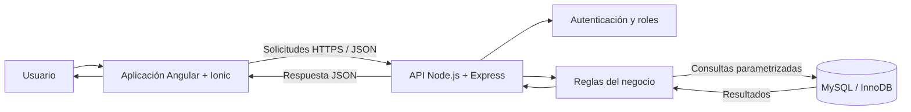
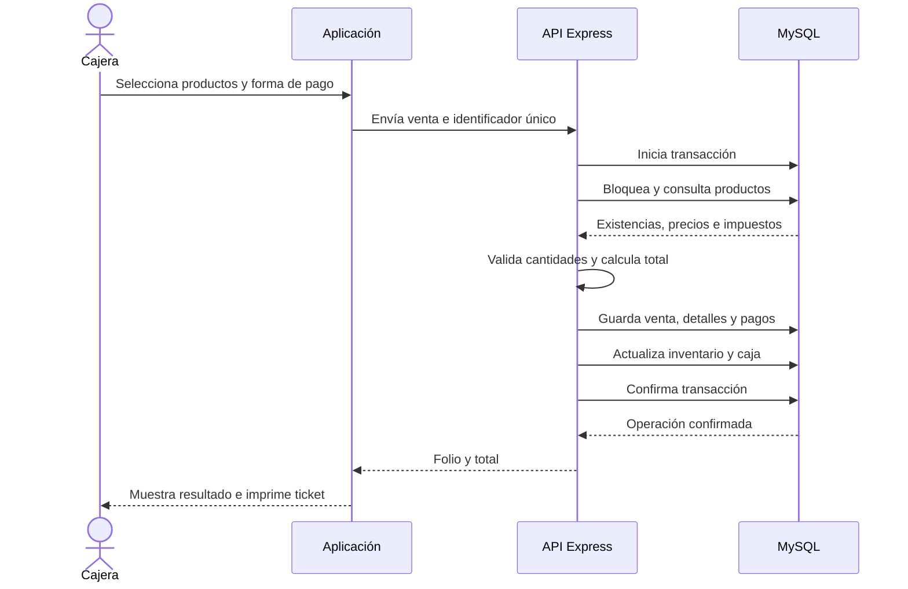
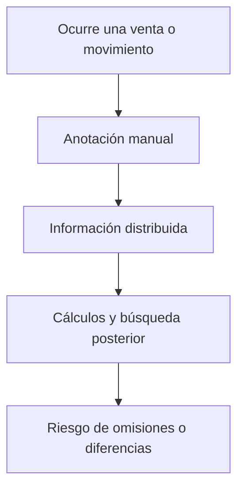
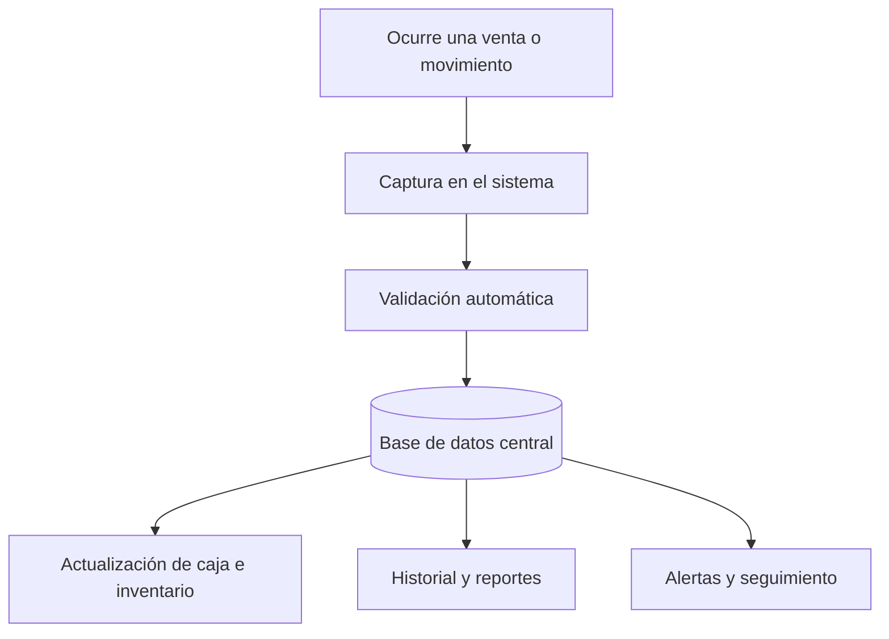

# INFORME DEL PROYECTO DE ESTADÍA

## Sistema de Gestión para Comercios

**Desarrollado en la empresa:** Abarrotes El Pedernal  
**Presentado por:** Claudia Karol Escalera Trinidad  
**Para obtener el título de:** Técnico Superior Universitario en Tecnologías de la Información, área Desarrollo de Software Multiplataforma  
**Asesor empresarial:** Ing. Alejandro Figueroa  

> Nota de revisión: antes de entregar, sustituir los textos marcados entre corchetes y actualizar el índice automático, la numeración de páginas, las figuras y los anexos.

---

# Dedicatorias

Dedico este trabajo a mis padres, por su apoyo incondicional, sus enseñanzas y por brindarme las herramientas necesarias para alcanzar mis metas académicas y personales. Gracias por confiar siempre en mí y por impulsarme a continuar aun en los momentos de mayor dificultad.

A mi esposo, por su comprensión, paciencia y apoyo constante durante este proceso. Gracias por acompañarme en cada etapa, por escucharme y por motivarme a seguir adelante cuando más lo necesitaba.

A mi familia, por estar presente durante mi formación y por celebrar conmigo cada avance alcanzado.

# Agradecimientos

Agradezco a Abarrotes El Pedernal por permitirme realizar mi estadía profesional dentro del negocio y por brindarme la oportunidad de desarrollar una solución orientada a necesidades reales. La disposición para explicar los procesos diarios de la tienda fue fundamental para comprender la problemática y proponer un sistema adecuado a su forma de trabajo.

De manera especial, agradezco al Ing. Alejandro Figueroa, asesor empresarial, por compartir su conocimiento sobre la operación del negocio, revisar los avances y aportar observaciones que ayudaron a mejorar las funciones del sistema.

Finalmente, agradezco a mis docentes, compañeros y familiares, quienes contribuyeron a mi formación y me apoyaron durante esta etapa.

# Introducción

El presente informe describe el proyecto de estadía profesional realizado en Abarrotes El Pedernal, negocio dedicado a la venta al por menor de productos básicos, alimentos, bebidas y artículos de uso cotidiano. El proyecto consistió en el análisis, diseño y desarrollo de un sistema de gestión que concentra procesos que anteriormente se realizaban mediante libretas, comprobantes impresos y archivos separados.

La necesidad del sistema surgió a partir del crecimiento de la operación y de la dificultad para consultar información confiable sobre ventas, existencias, movimientos de caja, cuentas de clientes y relación con proveedores. El registro manual permitía mantener la actividad diaria, pero exigía invertir tiempo en localizar datos, realizar cálculos y reconstruir movimientos cuando era necesario revisar una cuenta o tomar una decisión.

La solución desarrollada integra funciones de punto de venta, control de caja, inventario, compras, proveedores, clientes, fiados, usuarios, reportes, estadísticas y respaldos. También considera características propias de una tienda de abarrotes, como la venta de productos por pieza o a granel, el registro de pagos mediante distintos métodos, la suspensión de ventas y el seguimiento de cambio pendiente a favor de clientes.

El propósito no fue sustituir la dinámica cercana y flexible del establecimiento, sino ofrecer una herramienta que se adaptara a ella. Por esta razón, se diseñó una interfaz sencilla, utilizable desde computadora o tableta, con controles de acceso según las responsabilidades de cada usuario.

Para conocer la operación se utilizaron entrevistas semiestructuradas, observación directa y revisiones periódicas con el asesor empresarial. A partir de la información obtenida se diseñó una solución con arquitectura cliente-servidor, integrada por una aplicación desarrollada con Angular e Ionic, una API construida con Node.js y Express, y una base de datos MySQL. Como resultado se obtuvo una base funcional que centraliza los procesos definidos dentro del alcance y conserva trazabilidad sobre las operaciones. La medición de beneficios económicos y tiempos de atención deberá realizarse después de un periodo continuo de uso en el establecimiento.

El informe se organiza en cinco capítulos. El primero presenta el contexto de la empresa y su estructura organizacional. El segundo expone la problemática, los objetivos, requisitos, alcance y metodología. El tercero reúne los conceptos que sustentan la solución. El cuarto describe las actividades realizadas durante el desarrollo. Finalmente, el quinto presenta la evaluación de resultados, recomendaciones y conclusiones.

---

# Capítulo 1. Marco Referencial

## 1.1 Perfil De La Empresa

**Nombre o razón social:** Abarrotes El Pedernal  
**Giro:** Comercio al por menor de abarrotes, alimentos, bebidas, frutas, verduras, carnes y artículos de consumo básico.  
**Domicilio:** López Mateos s/n, carretera Calvillo km 22.5, Jesús María, Aguascalientes.  
**Teléfono:** 449 437 7355  
**Correo electrónico:** [CONFIRMAR CORREO; el número telefónico no corresponde a un correo]  
**Redes sociales:** Facebook: El Pedernal – Abarrotes; Instagram: Pedernal – Abarrotes.  
**Página web:** El negocio no cuenta actualmente con un sitio web propio.

## 1.2 Antecedentes Históricos

Abarrotes El Pedernal surgió como un negocio familiar impulsado por la iniciativa de la señora Rosa María Delgado Medina. En sus inicios, la actividad principal consistía en la venta de alimento para animales de uso agrícola. La operación se realizaba a pequeña escala y era atendida principalmente por la propietaria y otros integrantes de la familia.

Con el paso del tiempo, el aumento de la demanda y la confianza de los clientes permitieron incorporar productos de abarrotes y artículos de consumo diario. Esta ampliación convirtió al establecimiento en un punto de abastecimiento para habitantes de la zona y personas que transitan por la carretera.

Actualmente, la operación y administración del negocio se encuentra coordinada principalmente por Alejandro Figueroa Delgado, quien ha promovido mejoras administrativas y tecnológicas. Entre los retos que enfrenta la empresa se encuentran la variación frecuente de precios, el control de un catálogo cada vez mayor, el seguimiento de proveedores, la competencia comercial y la necesidad de contar con información oportuna sobre el estado del negocio.

## 1.3 ADMINISTRACIÓN ORGANIZACIONAL

### Misión

Brindar a la comunidad y a sus visitantes una experiencia de compra cercana, confiable y accesible, mediante la oferta de productos básicos y artículos de consumo diario, acompañada de un trato amable y familiar. Mantener la esencia de una tienda tradicional y, al mismo tiempo, mejorar sus procesos administrativos y tecnológicos para responder a las necesidades de sus clientes.

### Visión

Consolidarse como una tienda de preferencia en la región, reconocida por la cercanía con sus clientes, la variedad de productos y la calidad del servicio. Profesionalizar de manera continua sus procesos sin perder el trato humano que distingue al negocio y generar condiciones para un crecimiento futuro.

### Objetivos Estratégicos

- Profesionalizar el control administrativo mediante procesos claros y herramientas tecnológicas.
- Mejorar la experiencia del cliente, conservando una atención cercana y flexible.
- Incrementar la disponibilidad y variedad de productos de acuerdo con la demanda.
- Reducir errores en el registro de ventas, inventarios y cuentas pendientes.
- Contar con información útil para planear compras y tomar decisiones.
- Fortalecer la organización del trabajo y la asignación de responsabilidades.

### Normas Y Políticas

- Registrar las ventas y movimientos de caja en el momento en que ocurren.
- Mantener actualizadas las existencias y registrar entradas, ajustes y mermas.
- Evitar compartir contraseñas entre integrantes del personal.
- Respetar los permisos asignados a cada rol dentro del sistema.
- Verificar los pagos y referencias antes de confirmar una venta.
- Registrar los fiados a nombre del cliente correspondiente.
- Realizar respaldos periódicos de la información.
- Mantener un trato respetuoso con clientes, proveedores y colaboradores.

### Política De Calidad

En Abarrotes El Pedernal se busca satisfacer las necesidades de los clientes mediante productos en condiciones adecuadas, precios claros y atención personalizada. El negocio mantiene el compromiso de mejorar sus procesos, organizar la información y utilizar herramientas que permitan ofrecer un servicio confiable sin perder la cercanía con la comunidad.

### Valores

**Honestidad.** Realizar cada transacción con claridad, respetando precios, cantidades y acuerdos establecidos.

**Compromiso.** Atender las necesidades de los clientes y colaborar en el funcionamiento diario del negocio.

**Respeto.** Brindar un trato digno y amable a clientes, colaboradores y proveedores.

**Responsabilidad.** Cuidar la información, las existencias y los recursos económicos de la empresa.

**Servicio.** Mantener disposición para orientar al cliente y resolver sus necesidades de compra.

### Estructura Orgánica

La empresa utiliza una estructura vertical y lineal. Las decisiones generales recaen en la administración, mientras que el personal operativo se encarga de la atención al cliente, registro de ventas, recepción de mercancía y actividades de apoyo.

**Estructura propuesta para el organigrama:**

1. Propietaria.
2. Administrador general.
3. Gerencia o responsable de turno.
4. Personal de caja y atención.

> Insertar como Figura 1 el organigrama autorizado por la empresa.

## 1.4 Análisis FODA.

### Fortalezas

- Cercanía y confianza con los clientes de la comunidad.
- Conocimiento directo de los hábitos de compra de la zona.
- Atención flexible y personalizada.
- Variedad de productos básicos, frescos y de consumo diario.
- Participación directa de la familia en la operación.
- Capacidad para adaptar rápidamente el surtido.

### Oportunidades

- Digitalizar procesos que actualmente se realizan de forma manual.
- Utilizar reportes para mejorar la planeación de compras.
- Incrementar la variedad de productos de acuerdo con su rotación.
- Mejorar la comunicación con proveedores.
- Implementar promociones basadas en información de ventas.
- Ampliar el uso de pagos electrónicos y servicios complementarios.

### Debilidades

- Información distribuida entre libretas, tickets y archivos separados.
- Dependencia del conocimiento de pocas personas.
- Dificultad para consultar existencias y movimientos en tiempo real.
- Seguimiento manual de fiados y pagos parciales.
- Ausencia de indicadores consolidados para apoyar decisiones.
- Riesgo de errores al transcribir o calcular información.

### Amenazas

- Cambios frecuentes en precios y condiciones de proveedores.
- Competencia de cadenas y tiendas de conveniencia.
- Pérdida o deterioro de registros físicos.
- Fallas de energía, conexión o dispositivos.
- Resistencia al cambio por parte de usuarios acostumbrados al registro manual.
- Riesgos de seguridad si no se administran correctamente accesos y respaldos.

---

# Capítulo 2. Planificación del Proyecto

## 2.1 Descripción Del Problema

Antes del proyecto, Abarrotes El Pedernal realizaba una parte importante de sus actividades administrativas mediante registros manuales, libretas físicas, tickets de compra y hojas de cálculo. Aunque estas herramientas permitieron operar durante años, el crecimiento del negocio aumentó la cantidad de información que debía registrarse y consultar.

El problema principal era la falta de una herramienta centralizada para relacionar ventas, movimientos de caja, inventario, proveedores, clientes y fiados. Al encontrarse la información en diferentes medios, resultaba difícil obtener datos precisos sobre ingresos, salidas de efectivo, compras de mercancía y cuentas pendientes.

El control de fiados representaba una situación especialmente importante. Los saldos y abonos se anotaban en una libreta, por lo que revisar el historial de un cliente requería localizar registros anteriores y realizar cálculos manuales. Un error de escritura o una anotación incompleta podía ocasionar diferencias.

También se detectaron dificultades para conocer las existencias reales, identificar productos próximos a agotarse y dar seguimiento a entradas, mermas o ajustes. Esta falta de visibilidad complicaba la planeación de compras y podía provocar faltantes o adquisiciones innecesarias.

La operación de la tienda presenta particularidades que debían considerarse. Algunos productos se venden por pieza y otros por peso; una compra puede modificarse rápidamente mientras se atiende a más de un cliente; y se utilizan diferentes formas de pago. Por lo tanto, no era conveniente imponer un proceso rígido que hiciera más lenta la atención.

A partir de estas observaciones se planteó desarrollar un sistema de gestión flexible que organizara la información sin alterar la forma de servicio del negocio.

## 2.2 Objetivos Del Proyecto

### Objetivo General

Desarrollar un sistema de gestión flexible para Abarrotes El Pedernal que permita registrar, organizar y consultar los movimientos operativos y administrativos del negocio, con la finalidad de mejorar el control de la información, apoyar la toma de decisiones y reducir la dependencia de registros manuales.

### Objetivos Específicos

- Analizar los procesos administrativos y operativos de la tienda.
- Identificar los datos necesarios para controlar ventas, caja, inventario, clientes, fiados y proveedores.
- Diseñar una base de datos que relacione la información y conserve el historial de operaciones.
- Implementar un módulo de caja que permita registrar ventas y diferentes formas de pago.
- Controlar productos vendidos por pieza y productos vendidos por kilogramo o gramos.
- Implementar entradas, ajustes, mermas, conteos físicos y alertas de inventario.
- Dar seguimiento a clientes, fiados, abonos y saldos a favor.
- Administrar proveedores, compras y sugerencias de reposición.
- Generar reportes e indicadores para facilitar el análisis del negocio.
- Definir niveles de acceso para administración, gerencia y caja.
- Diseñar una interfaz adaptable a computadoras y dispositivos móviles.
- Verificar el funcionamiento mediante pruebas de los procesos principales.

### Requisitos del Proyecto

- Contar con acceso a la información necesaria sobre los procesos del negocio.
- Mantener comunicación periódica con el asesor empresarial.
- Utilizar un repositorio para el control de versiones.
- Documentar los requerimientos y cambios solicitados.
- Realizar pruebas antes de incorporar funciones a la operación.
- Proteger la información mediante autenticación, roles y respaldos.

### Requisitos del Producto

**Requisitos funcionales.**

- RF01. Permitir el inicio de sesión mediante correo y contraseña.
- RF02. Restringir funciones de acuerdo con el rol del usuario.
- RF03. Registrar apertura y cierre de caja.
- RF04. Registrar ventas con uno o varios productos.
- RF05. Aceptar pagos en efectivo, tarjeta, transferencia, fiado, saldo a favor o modalidad mixta.
- RF06. Calcular subtotal, descuentos, impuestos, total y cambio.
- RF07. Vender productos por pieza y a granel.
- RF08. Descontar automáticamente las existencias al confirmar una venta.
- RF09. Registrar entradas, ajustes, mermas y conteos físicos.
- RF10. Administrar productos, categorías, costos, precios y proveedores.
- RF11. Registrar clientes, límites de crédito, fiados y abonos.
- RF12. Administrar proveedores y compras.
- RF13. Consultar historial de ventas y permitir cancelaciones autorizadas.
- RF14. Generar reportes e indicadores.
- RF15. Mantener una bitácora de acciones importantes.
- RF16. Crear respaldos de la base de datos.

**Requisitos no funcionales.**

- RNF01. Presentar una interfaz clara y adaptable a distintos tamaños de pantalla.
- RNF02. Validar los datos antes de almacenarlos.
- RNF03. Proteger contraseñas mediante cifrado de una sola vía.
- RNF04. Mantener consistencia en ventas e inventario mediante transacciones.
- RNF05. Evitar que un usuario acceda a funciones que no corresponden a su rol.
- RNF06. Conservar el historial cuando un producto, proveedor o usuario se desactive.
- RNF07. Mostrar mensajes comprensibles cuando una operación no pueda completarse.
- RNF08. Permitir mantenimiento y ampliación posterior del sistema.

## 2.3 Cronograma

El proyecto se organizó en las siguientes etapas:

| Etapa | Actividades principales | Periodo planeado | Periodo real |
|---|---|---|---|
| Inducción | Conocimiento de la empresa y observación de procesos | [FECHA] | [FECHA] |
| Análisis | Entrevistas, problemas, requisitos y alcance | [FECHA] | [FECHA] |
| Diseño | Prototipos, arquitectura y base de datos | [FECHA] | [FECHA] |
| Desarrollo 1 | Autenticación, usuarios y estructura inicial | [FECHA] | [FECHA] |
| Desarrollo 2 | Caja, ventas e inventario | [FECHA] | [FECHA] |
| Desarrollo 3 | Clientes, fiados, proveedores y compras | [FECHA] | [FECHA] |
| Desarrollo 4 | Reportes, estadísticas, respaldos y ajustes | [FECHA] | [FECHA] |
| Pruebas | Validación funcional y correcciones | [FECHA] | [FECHA] |
| Implementación | Preparación del entorno y capacitación | [FECHA] | [FECHA] |
| Cierre | Documentación y entrega | [FECHA] | [FECHA] |

> Sustituir esta tabla por la gráfica de Gantt solicitada por la institución.

## 2.4 Justificación

El proyecto se justifica por la necesidad de contar con información ordenada y disponible para la operación diaria. La centralización reduce el tiempo dedicado a localizar registros y facilita el seguimiento de ventas, existencias y cuentas pendientes.

El sistema también permite conservar evidencia de los movimientos realizados. Esto mejora la revisión de diferencias y evita depender únicamente de la memoria o de anotaciones aisladas. En el caso de los fiados, cada abono queda relacionado con el cliente y su saldo.

Otro beneficio es la disponibilidad de indicadores. La administración puede consultar ventas, productos con baja existencia, movimientos de caja y cuentas por cobrar sin reconstruir manualmente la información. Esto contribuye a tomar decisiones con mayor fundamento.

Desde el punto de vista tecnológico, la aplicación establece una base que puede ampliarse conforme cambien las necesidades. Su diseño multiplataforma permite utilizarla desde navegador y prepararla para dispositivos móviles, evitando depender de un solo equipo.

## 2.5 Enunciado Del Alcance

El proyecto incluye:

- Análisis de los procesos de la tienda.
- Diseño de la arquitectura y base de datos.
- Autenticación y administración de usuarios.
- Roles de administrador, gerente y caja.
- Catálogo de productos y control de inventario.
- Ventas por pieza, kilogramo y gramos.
- Apertura, movimientos, arqueo y cierre de caja.
- Registro de clientes, fiados, abonos y saldos.
- Administración de proveedores y compras.
- Promociones, recargas y cambios pendientes.
- Reportes, estadísticas y bitácora.
- Respaldos y documentación operativa.
- Validación de los principales flujos de trabajo.

El proyecto no incluye:

- Timbrado fiscal en ambiente productivo con un proveedor autorizado.
- Integración bancaria directa.
- Comercio electrónico o entrega a domicilio.
- Control de múltiples sucursales.
- Contabilidad fiscal completa.
- Compra de equipo, lectores, básculas o terminales.
- Garantía de operación ante fallas externas de energía, red o hardware.

## 2.6 Metodología

El trabajo se desarrolló de forma iterativa, utilizando principios de Scrum adaptados a la duración de la estadía y al tamaño del equipo. No se aplicaron todos los eventos de un equipo Scrum formal, ya que el desarrollo fue realizado principalmente por una persona; sin embargo, se mantuvieron ciclos cortos de análisis, implementación, revisión y corrección.

Al inicio de cada ciclo se seleccionaron funciones prioritarias. Posteriormente se desarrolló una versión funcional y se presentó al asesor empresarial. Las observaciones obtenidas se incorporaron al siguiente ciclo. Este proceso permitió detectar necesidades que no eran evidentes durante el levantamiento inicial, como la captura de gramos en ventas a granel, los pagos mixtos, las ventas suspendidas y el registro de cambio pendiente.

Las etapas generales fueron:

1. Conocer la empresa y observar su operación.
2. Levantar y priorizar requerimientos.
3. Diseñar interfaces, arquitectura y base de datos.
4. Configurar herramientas y repositorio.
5. Desarrollar módulos de forma incremental.
6. Revisar cada incremento con el asesor empresarial.
7. Realizar pruebas y corregir errores.
8. Preparar documentación, respaldos y entrega.

**Factibilidad del proyecto.**

**Factibilidad técnica.**

El proyecto fue técnicamente viable porque pudo desarrollarse con herramientas compatibles con los equipos disponibles. Angular, Ionic, Node.js y MySQL cuentan con documentación y comunidades amplias. Además, la separación entre aplicación, API y base de datos permite ejecutar los componentes en un entorno local sin contratar inicialmente infraestructura externa.

La aplicación puede utilizarse desde un navegador y cuenta con preparación para Android. Esto permite aprovechar computadoras o tabletas existentes y evita depender de un dispositivo especializado para comenzar las pruebas.

**Factibilidad operativa.**

La factibilidad operativa se evaluó considerando que el personal está acostumbrado a una atención rápida. La interfaz concentra en Caja las acciones necesarias para vender, mientras que la configuración se encuentra en módulos administrativos. De este modo, el sistema no exige que la persona en caja gestione catálogos o proveedores durante una venta.

La adopción requiere capacitación y un periodo de acompañamiento. Durante los primeros días es conveniente comparar los registros digitales con el procedimiento anterior para detectar omisiones sin detener la operación.

**Factibilidad económica.**

El desarrollo utiliza tecnologías que no requieren pago de licencias para las funciones implementadas. Los costos posibles corresponden principalmente al equipo, mantenimiento, red local, impresión y, si se decide publicar el sistema, alojamiento y certificados.

No se afirma un ahorro económico específico porque todavía se necesita medir la operación durante un periodo representativo. Sin embargo, la reducción de registros duplicados y el acceso más rápido a la información representan beneficios potenciales.

**Análisis de riesgos.**

| Riesgo | Probabilidad | Impacto | Medida preventiva |
|---|---|---|---|
| Resistencia al cambio | Media | Alta | Capacitación y adopción gradual |
| Captura incompleta | Media | Alta | Validaciones y revisión de cierre |
| Pérdida de conexión | Media | Media | Ventas pendientes y red local estable |
| Falla del equipo | Baja | Alta | Respaldos externos y equipo alterno |
| Contraseñas compartidas | Media | Alta | Cuentas individuales y capacitación |
| Diferencias de inventario | Media | Alta | Conteos físicos y registro de mermas |
| Cambio de alcance | Alta | Media | Priorización y revisión por iteraciones |
| Pérdida de base de datos | Baja | Muy alta | Respaldos automáticos y pruebas de restauración |
| Precio desactualizado | Media | Media | Revisión al recibir mercancía |
| Uso de funciones sin autorización | Baja | Alta | Roles, middleware y bitácora |

**Matriz de trazabilidad.**

La trazabilidad de requisitos permite relacionar cada necesidad con su implementación y prueba.

| Requisito | Módulo | Validación principal | Caso de prueba |
|---|---|---|---|
| RF01 | Acceso | Credenciales y cuenta activa | CP-01, CP-02 |
| RF02 | Usuarios y rutas | Rol autorizado | CP-03 |
| RF03 | Caja | Fondo y sesión abierta | CP-04, CP-05 |
| RF04 | Ventas | Carrito con productos | CP-06 |
| RF05 | Pagos | Suma igual al total | CP-10, CP-11 |
| RF07 | Granel | Conversión y unidad | CP-07, CP-08 |
| RF08 | Inventario | Existencia suficiente | CP-09 |
| RF09 | Inventario | Cantidad y motivo | CP-14, CP-15 |
| RF11 | Fiados | Cliente, límite y vencidos | CP-12, CP-13 |
| RF13 | Historial | Rol y motivo | CP-16 |
| RF16 | Respaldos | Usuario autorizado | CP-18 |

---

# Capítulo 3. Marco Teórico

## 3.1 Sistemas de Gestión para Tiendas de Abarrotes

Un sistema de gestión comercial es una solución informática diseñada para registrar, organizar, procesar y consultar la información generada durante la operación de un negocio. Su propósito no se limita a sustituir registros escritos por formularios digitales. Un sistema de este tipo debe relacionar los procesos de venta, inventario, caja, compras, clientes y proveedores para que la información producida en una actividad pueda utilizarse de manera inmediata en las demás.

En los pequeños comercios es común que cada proceso se controle por separado. Las ventas pueden registrarse en tickets, los fiados en una libreta, las compras en facturas y las existencias mediante conteos ocasionales. Estos métodos permiten mantener la operación cuando el volumen de información es reducido; sin embargo, conforme aumenta la cantidad de productos y transacciones, también se incrementa el tiempo necesario para localizar datos, comparar registros y corregir diferencias.

La principal aportación de un sistema de gestión es la centralización de la información. Cuando una venta se confirma, el sistema puede registrar el ingreso, disminuir la existencia de los productos, actualizar el saldo del cliente cuando se trata de una venta a crédito y conservar los datos necesarios para elaborar reportes. De esta manera, una sola captura genera efectos coordinados y evita repetir el mismo registro en distintos medios.

La centralización también favorece la consistencia. Si cada área conserva su propia versión de la información, pueden existir cantidades distintas para un mismo producto o saldo. En cambio, una base de datos compartida establece una fuente principal de consulta. Esto permite que caja, inventario y administración trabajen con los mismos datos, siempre que los movimientos sean capturados correctamente y las reglas del sistema se apliquen de forma uniforme.

En una tienda de abarrotes, el sistema debe adaptarse a una operación dinámica. Durante una jornada pueden presentarse ventas continuas, cambios de precio, recepción de mercancía, productos vendidos por peso, pagos mediante diferentes métodos, devoluciones, mermas y ventas a crédito. Por ello, la solución debe responder con rapidez y al mismo tiempo conservar suficiente detalle para revisar posteriormente lo ocurrido.

Otro aspecto importante es la generación de información para la toma de decisiones. Los datos operativos pueden transformarse en indicadores como ventas por periodo, productos con mayor movimiento, artículos con baja existencia, cuentas pendientes de cobro, compras por proveedor y diferencias de caja. Estos indicadores no sustituyen la experiencia de la administración, pero ofrecen evidencia que facilita identificar problemas, planear compras y evaluar resultados.

La implementación de un sistema no elimina la necesidad de supervisión ni garantiza por sí sola que la información sea correcta. La calidad de los resultados depende de la calidad de los datos capturados. Si una entrada de mercancía no se registra o se utiliza una unidad incorrecta, la existencia mostrada dejará de coincidir con la cantidad física. Por esta razón, un sistema de gestión debe complementarse con procedimientos de operación, capacitación, validaciones automáticas y revisiones periódicas.

También debe considerarse que la digitalización modifica responsabilidades. Cada usuario necesita conocer qué actividades puede realizar, qué información debe verificar y qué procedimiento seguir ante una excepción. El control de acceso por roles, la bitácora de operaciones y los respaldos permiten reducir riesgos, pero deben acompañarse de políticas claras para el uso de contraseñas, cancelaciones, ajustes de inventario y recuperación de información.

En consecuencia, un sistema de gestión para una tienda de abarrotes puede entenderse como una herramienta integral de control operativo y administrativo. Su valor se encuentra tanto en automatizar cálculos como en mantener relaciones confiables entre los movimientos del negocio. Para Abarrotes El Pedernal, esta perspectiva permitió plantear una solución que no se concentrara únicamente en cobrar productos, sino que integrara los procesos que intervienen antes, durante y después de cada venta.

## 3.2 Sistema de Gestión para Tiendas de Abarrotes

### 3.2.1 Punto de venta

El punto de venta es el conjunto de funciones que permite registrar una transacción entre el comercio y el cliente. Normalmente incluye la identificación o selección de productos, captura de cantidades, cálculo de importes, aplicación de descuentos, elección de la forma de pago y generación de un comprobante. Aunque el cobro es su función más visible, también representa el origen de información utilizada por caja, inventario, clientes y reportes.

Un punto de venta debe reducir el tiempo de atención sin omitir validaciones importantes. La interfaz necesita permitir la búsqueda rápida de artículos, lectura de códigos de barras, modificación de cantidades y eliminación de partidas antes de confirmar. El sistema también debe mostrar con claridad el subtotal, descuentos, total recibido y cambio para que la persona encargada pueda revisar la operación antes de finalizarla.

En Abarrotes El Pedernal fue necesario considerar productos por pieza y productos a granel. Los artículos por pieza deben manejar cantidades enteras, mientras que los productos por peso requieren cantidades decimales. Para mantener uniformidad, el inventario conserva el kilogramo como unidad base y convierte los gramos capturados durante la venta. Por ejemplo, una captura de 500 gramos equivale a 0.500 kilogramos y una captura de 250 gramos equivale a 0.250 kilogramos.

La solución también contempla diferentes formas de pago. Una venta puede liquidarse mediante efectivo, tarjeta, transferencia, crédito o una combinación de métodos. En un pago mixto, la suma de los importes debe coincidir con el total de la venta. Esta validación evita registrar una operación parcialmente pagada por un error de captura. Cuando el pago es en efectivo, el sistema calcula el cambio; cuando se utiliza tarjeta o transferencia, puede conservarse una referencia para facilitar aclaraciones.

Las ventas suspendidas representan otra necesidad de la operación. Esta función permite guardar temporalmente un carrito sin afectar todavía la existencia ni la caja. Resulta útil cuando un cliente necesita buscar otro producto o cuando debe atenderse una segunda compra. Al recuperar la venta, las partidas se incorporan nuevamente a la pantalla de cobro y se validan antes de confirmar.

El comprobante o ticket sirve como evidencia para el cliente y como referencia para búsquedas posteriores. Debe incluir, entre otros datos, el identificador de la venta, fecha, productos, cantidades, precios, descuentos, total, forma de pago y persona que atendió. La posibilidad de reimprimir un ticket debe controlarse y quedar diferenciada de la emisión original para mantener claridad en la operación.

### 3.2.2 Control de inventarios

El inventario representa los productos disponibles para venta. Su control considera entradas, salidas, ajustes, mermas y conteos físicos. La existencia teórica se obtiene a partir de los movimientos registrados, mientras que el conteo físico permite comprobar la cantidad real.

Las entradas pueden originarse por la recepción de una compra, una devolución o una corrección autorizada. Las salidas se producen principalmente por ventas, aunque también pueden existir mermas, caducidades, daños o ajustes. Cada tipo de movimiento tiene un significado diferente y debe registrarse de manera separada para evitar que una diferencia se interprete de forma incorrecta.

El uso de una existencia mínima permite detectar productos que necesitan reposición. Cuando la cantidad disponible es igual o inferior a este nivel, el sistema puede generar una alerta o incluir el artículo en un pedido sugerido. La existencia mínima debe definirse considerando la velocidad de venta, el tiempo de entrega del proveedor y el espacio disponible para almacenamiento.

Los conteos físicos son necesarios porque la existencia calculada puede separarse de la cantidad real debido a capturas omitidas, daños, errores de unidad o pérdidas. Durante un conteo se compara la existencia teórica con la cantidad observada. Si hay una diferencia, el ajuste debe solicitar un motivo y conservar los valores anterior y nuevo. Esto permite corregir el inventario sin perder evidencia.

La administración de lotes y fechas de caducidad agrega un nivel adicional de control. Dos unidades del mismo producto pueden haber ingresado en fechas distintas y tener diferentes vencimientos. Al conservar esta información es posible identificar mercancía próxima a caducar y priorizar su venta. Las alertas anticipadas ayudan a tomar medidas, como acomodar primero el lote más antiguo o aplicar una promoción autorizada.

La trazabilidad es esencial en el control de inventarios. No basta con conocer la existencia actual; también debe ser posible determinar qué operación la modificó, cuándo ocurrió, qué cantidad cambió y qué usuario la registró. Esta información facilita investigar diferencias y comprender la evolución de un artículo.

### 3.2.3 Compras y proveedores

El proceso de compras conecta las necesidades del inventario con la mercancía ofrecida por los proveedores. Una compra puede comenzar con la identificación de productos por debajo de su existencia mínima y continuar con la selección del proveedor, captura de cantidades, costos y recepción.

El catálogo de proveedores debe conservar datos de identificación y contacto, así como los productos que suministra y, cuando sea útil, sus días habituales de entrega. Esta relación permite consultar alternativas de abastecimiento y facilita preparar pedidos. No obstante, el sistema constituye una herramienta de apoyo; la decisión final también depende de precios, calidad, disponibilidad, promociones y condiciones de pago.

Al recibir una compra, las cantidades aceptadas deben incrementar el inventario. Además, puede actualizarse el último costo del producto para disponer de una referencia reciente. Esta modificación debe realizarse dentro de una operación controlada: no sería correcto registrar la compra sin actualizar las existencias, ni aumentar las existencias si la compra no quedó confirmada.

El pedido sugerido utiliza información como existencia actual y nivel mínimo para proponer cantidades. Su finalidad es disminuir omisiones y agilizar la revisión del surtido. La propuesta debe poder modificarse, ya que la experiencia de la administración y las condiciones del proveedor pueden justificar comprar una cantidad diferente.

### 3.2.4 Clientes, fiados y abonos

El registro de clientes permite relacionar ventas, saldos y pagos con una persona identificable. En una tienda de abarrotes esta función resulta especialmente útil para administrar fiados, ya que reemplaza cálculos dispersos por un historial ordenado de cargos y abonos.

Una venta a crédito aumenta el saldo pendiente del cliente. Antes de autorizarla, el sistema debe comprobar que el cliente esté activo, que disponga de crédito y que la operación no supere el límite establecido. También puede advertir sobre adeudos vencidos. Estas validaciones ayudan a aplicar de manera consistente las reglas definidas por el negocio.

Un abono disminuye la deuda, pero debe conservarse como movimiento independiente. Si solo se reemplazara el saldo final, sería imposible conocer cuándo y cómo se realizaron los pagos. El historial debe incluir fecha, importe, forma de pago, usuario que registró el movimiento y saldo resultante.

El saldo a favor se presenta cuando el cliente entrega una cantidad superior a la deuda o cuando una devolución genera crédito. Este importe debe distinguirse de un fiado, porque representa una obligación del negocio hacia el cliente. La separación entre deuda y saldo a favor evita confusiones al aplicarlos en ventas posteriores.

### 3.2.5 Control de caja

El control de caja organiza los movimientos monetarios asociados con un turno. La apertura registra el fondo inicial disponible para entregar cambio. Durante la jornada se acumulan cobros y pueden registrarse entradas o salidas autorizadas. Al finalizar se realiza un arqueo para comparar el efectivo esperado con el efectivo contado.

El efectivo esperado se calcula a partir del fondo inicial, las ventas en efectivo y los demás movimientos de caja. Los pagos con tarjeta o transferencia forman parte de las ventas, pero no incrementan físicamente el dinero del cajón. Esta separación es necesaria para evitar diferencias aparentes.

El corte X permite consultar el estado del turno sin cerrarlo. El corte Z representa el cierre definitivo y resume los importes del periodo. Si existe una diferencia entre el efectivo esperado y el contado, el sistema debe conservarla para revisión. Una diferencia no debe ocultarse modificando ventas; debe registrarse y explicarse conforme al procedimiento administrativo.

La relación entre caja y usuarios permite conocer quién abrió, operó y cerró un turno. También evita que se registren ventas sin una caja activa o que se cierre cuando todavía existen operaciones pendientes de sincronización.

### 3.2.6 Base de datos relacional

Una base de datos relacional organiza la información en tablas vinculadas mediante identificadores. En este proyecto, una venta se relaciona con su usuario, cliente, detalles, pagos y movimientos de inventario.

La organización en tablas evita repetir información innecesariamente. Por ejemplo, los datos principales de un producto se almacenan una sola vez y cada detalle de venta conserva una referencia a ese producto. De forma similar, un cliente puede relacionarse con varias ventas y abonos sin duplicar todos sus datos en cada movimiento.

Las claves primarias identifican de manera única cada registro y las claves foráneas mantienen las relaciones entre tablas. Estas restricciones ayudan a impedir que se cree un detalle de venta asociado con una venta inexistente o que se pierdan referencias históricas por una eliminación incorrecta.

Se utilizó MySQL con el motor InnoDB. Las transacciones permiten agrupar varias instrucciones y confirmar todas mediante `COMMIT` o cancelar sus cambios mediante `ROLLBACK`. Esta propiedad es fundamental para operaciones compuestas. Una venta debe registrar su encabezado, partidas, pagos y disminuciones de inventario como una sola unidad lógica. Si alguna validación falla, todos los cambios deben revertirse.

La base de datos también aplica tipos y restricciones. Los importes requieren precisión decimal, las fechas deben conservar un formato consistente y las cantidades deben cumplir las reglas de su unidad. Estas medidas complementan las validaciones de la interfaz y del servidor.

El diseño debe equilibrar la información actual con el historial. En lugar de borrar físicamente un producto o proveedor que ya participó en operaciones, se utiliza un estado activo o inactivo. Así se evita su uso en nuevas capturas, pero se conservan las relaciones necesarias para consultar ventas y compras anteriores.

### 3.2.7 Arquitectura cliente-servidor

La arquitectura cliente-servidor separa la interfaz que utiliza la persona del servicio encargado de validar reglas y acceder a la base de datos. En este proyecto, la aplicación cliente envía solicitudes a una API. El servidor verifica permisos y datos antes de consultar o modificar MySQL.

La aplicación cliente se encarga de presentar formularios, recibir acciones y mostrar resultados. La API recibe solicitudes, valida la sesión y aplica las reglas del negocio. La base de datos almacena la información de forma persistente. Esta distribución asigna responsabilidades claras y evita que la aplicación móvil contenga credenciales directas de MySQL.

La comunicación se realiza mediante solicitudes HTTP. Los métodos pueden representar operaciones como consultar, crear, actualizar o desactivar registros. La API devuelve códigos de estado y mensajes que permiten a la interfaz distinguir entre una solicitud correcta, datos inválidos, falta de autorización o una falla interna.

Centralizar las reglas en el servidor evita depender únicamente de la interfaz. Aunque un formulario impida capturar una cantidad negativa, la API debe validar nuevamente el dato, porque una solicitud podría originarse desde otra versión de la aplicación. Esta validación en varias capas reduce el riesgo de almacenar información incorrecta.

La separación también facilita el mantenimiento. Es posible modificar la presentación sin cambiar la estructura de la base de datos, o ampliar la API para admitir otro tipo de cliente. Sin embargo, esta arquitectura depende de la disponibilidad de la red y del servidor, por lo que requiere monitoreo, arranque automático y procedimientos para atender interrupciones.

### 3.2.8 Aplicaciones multiplataforma

Una aplicación multiplataforma utiliza una misma base de desarrollo para operar en más de un entorno. El proyecto fue construido con Angular e Ionic. Angular organiza la interfaz mediante componentes y servicios, mientras que Ionic proporciona elementos visuales adaptables y herramientas para preparar aplicaciones móviles.

Angular permite dividir la solución en páginas, componentes, servicios y rutas. Esta organización favorece la reutilización y separa la lógica de presentación de la comunicación con la API. Los servicios compartidos concentran tareas como autenticación, consulta de productos e impresión.

Ionic proporciona controles adaptados a interacción táctil y estilos que pueden utilizarse en navegador y dispositivos móviles. Capacitor permite empaquetar la aplicación web como una aplicación nativa y acceder a capacidades del equipo mediante complementos. En este proyecto, esta posibilidad es importante para el uso en tabletas y la integración con impresión.

Una base de código compartida reduce la duplicación, pero no elimina la necesidad de pruebas específicas. El tamaño de pantalla, orientación, permisos, acceso a red y comportamiento del teclado pueden variar entre computadora, tableta y teléfono. Por ello, el diseño adaptable y las pruebas en dispositivos reales forman parte del desarrollo multiplataforma.

### 3.2.9 Seguridad y control de acceso

El control de acceso basado en roles asigna permisos según las responsabilidades del usuario. En el sistema se definieron tres perfiles:

- **Administrador:** configuración general, usuarios, auditoría y acceso completo.
- **Gerente:** operación, inventario, proveedores y consulta de indicadores.
- **Cajera:** ventas y funciones necesarias para la atención.

El principio de privilegio mínimo establece que cada persona debe disponer solamente de las funciones necesarias para realizar su trabajo. De este modo, la persona en caja puede registrar ventas sin tener permiso para administrar usuarios o restaurar respaldos. La restricción debe aplicarse tanto en la navegación de la interfaz como en la API.

Las contraseñas no se almacenan como texto legible. Se procesan mediante una función hash que genera una representación no reversible. Al iniciar sesión, el sistema compara la contraseña proporcionada con el hash almacenado. Si la autenticación es correcta, se genera un token temporal que identifica la sesión y acompaña las solicitudes protegidas.

La seguridad también incluye medidas contra intentos repetidos, vencimiento de sesión y control de cuentas inactivas. Una cuenta desactivada no debe iniciar nuevas sesiones, aunque su historial debe mantenerse asociado con las operaciones efectuadas anteriormente.

La bitácora registra acciones relevantes, como ajustes, cancelaciones, cambios de usuario y restauraciones. Su objetivo no es vigilar actividades ordinarias, sino conservar evidencia que facilite aclarar modificaciones sensibles. Para ser útil debe incluir usuario, fecha, acción y referencia del registro afectado.

### 3.2.10 Desarrollo iterativo y Scrum

Scrum es un marco de trabajo para desarrollar productos complejos mediante entregas incrementales. El trabajo se organiza en periodos cortos y el resultado de cada periodo se revisa para decidir los siguientes pasos.

Para este proyecto se utilizó una adaptación de sus principios, debido a que el desarrollo fue realizado principalmente por una persona y dentro del periodo definido para la estadía. Las funciones pendientes se mantuvieron en una lista priorizada y el asesor empresarial participó como fuente de requisitos y revisor del producto.

Cada ciclo incluyó selección de actividades, implementación, prueba y revisión. El resultado funcional permitió obtener observaciones más concretas que una descripción escrita. Por ejemplo, el uso del módulo de caja ayudó a detectar la necesidad de ventas suspendidas, pagos mixtos y captura de productos a granel.

El desarrollo incremental disminuyó el riesgo de descubrir problemas únicamente al final. También permitió atender primero los procesos esenciales y agregar funciones complementarias después de contar con una base estable. La adaptación no se presenta como una aplicación completa de todos los eventos y roles de Scrum, sino como el uso de principios iterativos apropiados para el contexto.

### 3.2.11 Ingeniería de requisitos

La ingeniería de requisitos comprende las actividades utilizadas para descubrir, analizar, documentar y validar las necesidades que debe resolver un sistema. Esta disciplina es importante porque una petición inicial suele expresar solamente una parte del problema. El usuario puede solicitar una pantalla o una función específica, pero detrás de ella existen reglas, excepciones y relaciones con otros procesos.

Los requisitos se clasifican comúnmente en funcionales y no funcionales. Los funcionales describen lo que el sistema debe hacer, por ejemplo, registrar una venta o descontar existencias. Los no funcionales establecen condiciones de calidad y operación, como seguridad, facilidad de uso, consistencia o adaptabilidad a diferentes dispositivos.

El levantamiento puede utilizar entrevistas, observación directa, revisión de documentos y análisis de procesos. En un pequeño comercio, la observación es especialmente útil porque varias reglas se aplican por experiencia y no se encuentran escritas. Preguntar qué sucede durante una venta permite conocer el flujo común; observar la atención ayuda a identificar interrupciones y excepciones.

Después del levantamiento, los requisitos deben analizarse para detectar contradicciones, dependencias y prioridades. Registrar una venta depende de que exista una caja abierta, productos activos y existencia suficiente. Una venta a crédito agrega la necesidad de identificar al cliente y comprobar su límite. Estas relaciones deben documentarse para evitar desarrollar funciones aisladas.

Durante el proyecto, los requisitos no se consideraron definitivos después de la primera entrevista. Cada revisión permitió precisar reglas. Un ejemplo fue la venta a granel: no bastaba con aceptar números decimales, ya que la persona en caja necesitaba expresar la cantidad en gramos o kilogramos, mientras que el inventario debía conservar una unidad uniforme.

La validación de requisitos consiste en comprobar que la función implementada resuelva la necesidad original. Para ello se preparan casos de prueba con condiciones normales y excepcionales. No solo debe verificarse que una venta correcta se registre, sino también que el sistema rechace cantidades superiores a la existencia, pagos incompletos o créditos no autorizados.

### 3.2.12 Experiencia de usuario y accesibilidad

La experiencia de usuario se refiere a la percepción que una persona tiene al interactuar con un producto. En una aplicación administrativa incluye la claridad de los textos, el orden de los elementos, el número de pasos necesarios y la respuesta que ofrece el sistema después de una acción.

Para un punto de venta, la rapidez y la prevención de errores son prioritarias. Los controles deben poder utilizarse con poca capacitación y los mensajes deben explicar qué ocurrió. Una alerta que solamente indique “error” no ayuda a corregir una captura; en cambio, un mensaje como “la existencia disponible es menor que la cantidad solicitada” orienta al usuario.

El diseño también debe considerar distintos tamaños de pantalla. La aplicación utiliza distribuciones que se reorganizan cuando el espacio disponible disminuye. Las tablas pueden desplazarse horizontalmente y los formularios cambian de varias columnas a una columna en dispositivos pequeños.

La consistencia visual reduce el esfuerzo de aprendizaje. Botones con funciones semejantes deben mantener nombres, colores y ubicaciones previsibles. Las acciones destructivas o difíciles de revertir requieren confirmación y deben diferenciarse de las acciones ordinarias.

La accesibilidad considera contraste, tamaño de texto, etiquetas comprensibles y áreas táctiles suficientes. El color no debe ser el único medio para comunicar un estado; una alerta de inventario puede combinar color, texto e icono. También es necesario indicar cuando una operación está en proceso para evitar que el usuario presione varias veces y genere solicitudes duplicadas.

### 3.2.13 Integridad y trazabilidad de la información

La integridad consiste en mantener datos válidos y coherentes. Puede protegerse mediante restricciones de base de datos, validaciones del servidor y reglas de interfaz. Por ejemplo, una existencia no debe ser negativa y una cantidad vendida debe ser mayor que cero.

La trazabilidad permite reconstruir el origen y efecto de una operación. Para ello no es suficiente conocer la existencia actual de un producto; también se necesita saber qué movimientos la modificaron. El sistema registra usuario, fecha, tipo, cantidad anterior, cantidad nueva y motivo.

En operaciones sensibles se utiliza eliminación lógica. Un producto que ya participó en ventas no se borra físicamente, porque esto dejaría detalles históricos sin referencia. En su lugar, se marca como inactivo y deja de mostrarse en la operación normal.

La integridad también depende de la concurrencia. Dos dispositivos podrían intentar vender el último producto casi al mismo tiempo. Aunque ambos hayan mostrado existencia, el servidor debe verificarla nuevamente durante la transacción. Así, solamente una operación puede consumir la cantidad disponible y la otra recibe una respuesta indicando que ya no existe inventario suficiente.

Las cancelaciones y devoluciones deben conservar el registro original y generar movimientos compensatorios. Modificar directamente una venta anterior dificultaría conocer qué ocurrió. Al conservar ambos eventos se mantiene un historial completo y se pueden explicar los cambios en caja e inventario.

### 3.2.14 Respaldo, recuperación y continuidad

Un respaldo es una copia de la información que puede utilizarse ante pérdida, daño o modificación incorrecta. La existencia de un archivo de respaldo no garantiza por sí sola la recuperación; también es necesario almacenarlo en un lugar seguro y comprobar periódicamente que pueda restaurarse.

El proyecto contempla la generación de copias de MySQL y el registro de respaldos realizados. Para reducir riesgos, se recomienda conservar más de una copia, mantener al menos una fuera del equipo principal y restringir la restauración a usuarios autorizados.

La frecuencia de respaldo debe relacionarse con la cantidad de información que el negocio puede permitirse perder. Una copia diaria reduce el periodo de pérdida frente a una copia semanal, pero todavía deben contemplarse las operaciones realizadas después del último respaldo. Por ello, es conveniente generar copias automáticas y respaldos adicionales antes de cambios importantes.

La restauración es una operación sensible porque reemplaza información actual por el contenido de una copia. Debe requerir autorización, confirmación explícita y, de ser posible, la creación de un respaldo inmediato antes de comenzar. También es necesario realizar pruebas periódicas en un entorno controlado para comprobar que los archivos sean utilizables.

La continuidad operativa incluye más elementos que la base de datos. El servidor debe iniciar automáticamente, reiniciarse ante fallas y permanecer disponible para los dispositivos de la red local. La computadora que aloja la API y MySQL necesita mantenerse encendida, conectada a la red y con una dirección estable. También debe existir un procedimiento para verificar el estado del servicio y actuar cuando falle la energía o el equipo.

### 3.2.15 Operación ante interrupciones de conexión

Una aplicación web puede enfrentar interrupciones temporales de red aun cuando el servidor se encuentre dentro del mismo establecimiento. En el módulo de caja se diseñó un mecanismo para conservar ventas pendientes en el dispositivo. Cada operación recibe un identificador único; al recuperar la conexión, el servidor verifica dicho identificador para evitar un registro duplicado.

El identificador único permite aplicar idempotencia. Si el dispositivo envía una operación y pierde la conexión antes de recibir la respuesta, no puede saber inmediatamente si el servidor la guardó. Al repetir la solicitud con el mismo identificador, el servidor puede reconocerla y evitar una segunda venta.

Las operaciones pendientes deben almacenarse localmente hasta obtener una confirmación. La interfaz necesita informar cuántas ventas esperan sincronización y distinguirlas de las ya registradas. Al recuperar la red, el sistema intenta enviarlas y comunica cualquier conflicto que requiera revisión.

Esta estrategia no convierte toda la aplicación en un sistema completamente desconectado. Consultar información actual, administrar usuarios o realizar una restauración requiere comunicación con el servidor. El mecanismo se concentra en proteger una de las situaciones de mayor impacto: perder una venta ya capturada.

Mientras existan operaciones pendientes, el cierre de caja debe bloquearse o realizarse con precaución, porque los totales del servidor todavía no incluyen esas ventas. De esta forma, la operación sin conexión se integra con las reglas de caja y no funciona como un registro aislado.

En conjunto, los conceptos presentados en este marco teórico explican las decisiones principales del sistema desarrollado. La relación entre punto de venta, inventario, caja, compras, clientes y reportes exige una base de datos consistente y una API que centralice reglas. La seguridad, la trazabilidad, los respaldos y la tolerancia a interrupciones complementan las funciones visibles y permiten que la solución responda a las condiciones reales de Abarrotes El Pedernal.

---

# Capítulo 4. Desarrollo del Proyecto

## 4.1 Levantamiento de requerimientos

La primera actividad consistió en conocer la operación de Abarrotes El Pedernal. Para ello realicé entrevistas semiestructuradas con el administrador y observé la forma en que se atendían ventas, se registraban fiados y se controlaba la mercancía.

Las preguntas se enfocaron en:

- Actividades que se realizan durante la apertura y cierre.
- Forma de registrar ventas y gastos.
- Métodos de pago aceptados.
- Manejo de productos por pieza y a granel.
- Control de existencias y recepción de mercancía.
- Registro de fiados y abonos.
- Relación con proveedores.
- Reportes que necesita la administración.
- Responsabilidades de cada integrante del personal.

El levantamiento permitió concluir que no era suficiente desarrollar únicamente una pantalla de cobro. La necesidad real era relacionar la venta con caja, inventario, clientes y reportes.

### 4.1.1 Técnicas utilizadas para obtener información

El levantamiento no se limitó a preguntar qué pantallas necesitaba el negocio. Primero fue necesario comprender cómo se realizaban las actividades, quién intervenía en ellas, qué documentos se utilizaban y cuáles eran las situaciones que producían mayor dificultad. Para obtener esta información se combinaron entrevistas semiestructuradas, observación directa y revisión de los registros disponibles.

Las entrevistas partieron de una lista de temas, pero permitieron formular preguntas adicionales conforme aparecían ejemplos o excepciones. Esta flexibilidad fue importante porque algunas reglas se aplicaban por costumbre y no estaban documentadas. Por ejemplo, el manejo de productos vendidos por peso parecía inicialmente una variación sencilla de la venta por pieza; durante la conversación se identificó que la captura debía admitir gramos y kilogramos sin obligar al personal a realizar conversiones manuales.

La observación directa permitió analizar la secuencia real de atención. Se consideró la forma de localizar productos, calcular importes, recibir pagos y responder cuando un cliente agregaba o retiraba artículos. También se observaron actividades que ocurrían fuera de la venta, como revisar mercancía, anotar fiados, recibir abonos y consultar precios.

La revisión de libretas, tickets y comprobantes ayudó a identificar los datos mínimos que debían conservarse. Estos documentos mostraron que no bastaba con almacenar un total general: era necesario mantener fecha, productos, cantidades, formas de pago, cliente relacionado y responsable de la operación.

Para evitar interpretaciones incorrectas, al finalizar cada revisión se resumieron los hallazgos y se compararon con el asesor empresarial. Cuando una necesidad todavía presentaba dudas, se conservó como asunto pendiente y no como requisito definitivo. Esta práctica permitió diferenciar una idea inicial de una regla validada.

### 4.1.2 Análisis y clasificación de requerimientos

Después de recopilar la información, clasifiqué las necesidades por módulo y prioridad. Las funciones relacionadas con autenticación, caja, ventas e inventario se consideraron esenciales. Posteriormente se incorporaron clientes, fiados, proveedores, compras, reportes y respaldos.

También identifiqué reglas que debían validarse en el servidor:

- No vender una cantidad superior a la existencia.
- No aceptar fracciones en productos por pieza.
- Convertir gramos a kilogramos.
- Impedir que una venta se registre sin una caja abierta.
- Verificar que los pagos coincidan con el total.
- Solicitar un cliente para ventas a crédito.
- Evitar que usuarios sin permiso cancelen ventas.
- Conservar historial cuando un registro se desactive.

Los requerimientos se clasificaron por módulo, prioridad y dependencia. La autenticación, la apertura de caja y el catálogo de productos se colocaron antes que los reportes, porque una consulta de ventas solo puede construirse después de contar con operaciones registradas correctamente. Del mismo modo, los fiados dependían del catálogo de clientes y del proceso de venta.

Para establecer prioridades se utilizaron tres categorías:

- **Esencial:** función sin la cual no podía completarse el proceso principal, como iniciar sesión, abrir caja, registrar una venta o descontar inventario.
- **Importante:** función necesaria para controlar la operación, aunque podía desarrollarse después del flujo principal, como compras, proveedores, fiados y cancelaciones.
- **Complementaria:** función que mejora el análisis o la comodidad, como gráficas, temas visuales y determinadas opciones de exportación.

También se distinguieron las reglas visibles de las reglas internas. Una regla visible se comunica directamente en la interfaz, por ejemplo, impedir una cantidad fraccionaria para un artículo vendido por pieza. Una regla interna protege la consistencia aunque el usuario no observe todo el proceso, como bloquear temporalmente una fila de inventario mientras se confirma una venta.

Cada requerimiento se relacionó con una condición de aceptación. Para la venta a granel, la función no se consideró terminada solo por mostrar un campo decimal; debía aceptar gramos o kilogramos, convertir la captura a la unidad base, calcular el importe correcto y descontar exactamente la cantidad correspondiente.

### 4.1.3 Modelado de procesos

Una vez identificadas las necesidades, se describieron los procesos principales mediante pasos, actores, entradas y resultados. Este modelado permitió visualizar qué información se generaba y qué otros módulos debían recibirla.

En el proceso de venta se identificaron como entradas los productos, cantidades, cliente y formas de pago. Como condiciones previas se establecieron una sesión válida, una caja abierta y productos activos. Los resultados incluyeron la venta, sus partidas, el movimiento de caja, la disminución del inventario y, cuando correspondía, una cuenta por cobrar.

El proceso de compra se modeló de forma semejante. La recepción necesita un proveedor, productos, cantidades y costos. Su resultado debe conservar la compra, incrementar existencias, generar movimientos de inventario y actualizar la referencia de costo. Este análisis evitó tratar la compra como un documento aislado.

Los procesos excepcionales se documentaron junto con los normales. Entre ellos se incluyeron existencia insuficiente, pago incompleto, conexión interrumpida, cancelación, devolución parcial, cliente sin crédito y diferencia de caja. Considerar estas situaciones desde el análisis redujo la posibilidad de implementar únicamente el escenario ideal.

## 4.2 Diseño general de la solución

La solución se dividió en tres partes:

1. **Aplicación cliente:** desarrollada con Angular e Ionic.
2. **API:** desarrollada con Node.js y Express.
3. **Base de datos:** implementada en MySQL.

La interfaz se organizó en páginas independientes para caja, inventario, clientes, fiados, proveedores, compras, reportes, estadísticas, usuarios y configuración. Los servicios compartidos concentran la comunicación con la API, autenticación, impresión y alertas.

La base de datos se diseñó para conservar trazabilidad. En lugar de modificar únicamente el total de una existencia, se registra un movimiento con la cantidad anterior, cantidad nueva, usuario y motivo.

> Insertar Figura 2: arquitectura general.  
> Insertar Figura 3: diagrama entidad-relación.

### 4.2.1 Criterios de diseño

El diseño se orientó por cinco criterios: claridad, consistencia, trazabilidad, seguridad y capacidad de crecimiento. La claridad se aplicó a la interfaz y los mensajes; la consistencia, a las reglas y transacciones; la trazabilidad, al historial; la seguridad, a sesiones y permisos; y la capacidad de crecimiento, a la separación modular.

Se evitó colocar todas las funciones en una sola pantalla. Caja concentra la atención de ventas, mientras que inventario, proveedores, usuarios y respaldos se encuentran en áreas separadas. Esto reduce la cantidad de controles visibles durante el cobro y disminuye el riesgo de ejecutar una acción administrativa por accidente.

Las operaciones críticas se diseñaron para confirmarse de forma explícita. Cancelaciones, ajustes, mermas y restauraciones requieren información adicional o una confirmación. En cambio, las consultas y búsquedas pueden realizarse sin pasos innecesarios.

Los mensajes se plantearon como parte del diseño funcional. Cuando una operación se rechaza, el sistema debe explicar la causa y, cuando sea posible, indicar cómo corregirla. Esta decisión es especialmente relevante en una aplicación que será utilizada durante la atención al público, donde una respuesta ambigua retrasa el servicio.

### 4.2.2 Prototipado de interfaces

Antes de completar la lógica de cada módulo se definió la distribución general de sus elementos. En Caja se priorizaron la búsqueda, el carrito, los totales y el botón de cobro. En Inventario se dio mayor espacio a filtros, existencias y estados. En los paneles administrativos se utilizaron tarjetas e indicadores para resumir información.

Los formularios se organizaron por grupos relacionados. Los datos básicos aparecen antes que configuraciones especiales; por ejemplo, nombre, código y categoría preceden a existencia mínima, unidad y proveedor. Los campos obligatorios se validan antes de enviar la solicitud.

El prototipo también consideró dispositivos táctiles. Los botones principales utilizan áreas suficientemente amplias, las distribuciones cambian a una sola columna cuando el espacio disminuye y las tablas permiten desplazamiento. Las pruebas en tableta fueron necesarias para comprobar que el teclado virtual no ocultara acciones importantes.

## 4.3 Desarrollo e integración de módulos

### 4.3.1 Autenticación y usuarios

Se implementó inicio de sesión, protección de rutas y control de permisos. El administrador puede crear, editar, activar, desactivar o retirar cuentas. Cuando una cuenta se retira, su historial permanece relacionado con las operaciones anteriores.

El formulario de acceso envía las credenciales a la API. El servidor localiza la cuenta por correo, verifica que se encuentre activa y compara la contraseña con el hash almacenado. Si los datos son correctos, devuelve la información básica del usuario y un token firmado.

En la aplicación se utilizaron guardias de navegación para impedir que una persona sin sesión abra páginas protegidas. También se definieron guardias específicos para módulos administrativos y estadísticas. Estas barreras mejoran la navegación, pero la autorización definitiva se realiza nuevamente en el servidor.

La administración de usuarios contempla creación, cambio de datos, activación, desactivación y cambio de contraseña. No se elimina el historial de una cuenta que ya registró operaciones. Cuando se modifica la contraseña o se retira el acceso, las sesiones anteriores deben dejar de ser válidas.

### 4.3.2 Caja y ventas

El módulo de caja permite abrir un turno con fondo inicial, registrar ventas, seleccionar forma de pago y calcular cambio. También admite pagos mixtos, referencias de tarjeta o transferencia y ventas a crédito.

Se incorporaron ventas suspendidas para atender otra operación sin perder el carrito. Además, el sistema conserva temporalmente ventas cuando se pierde la conexión y evita duplicarlas al sincronizar.

La apertura de caja solicita el fondo inicial y relaciona el turno con el usuario. A partir de ese momento, cada venta y movimiento queda vinculado con la sesión. El servidor impide registrar una venta cuando no existe un turno activo.

Durante la captura, el carrito mantiene producto, cantidad, unidad, precio e importe preliminar. El total mostrado en la interfaz sirve como referencia; al confirmar, la API consulta nuevamente precios, promociones y existencias. Esto evita que una pantalla con información desactualizada determine por sí sola el resultado final.

El cobro separa los métodos de pago y valida sus condiciones. Efectivo requiere una cantidad suficiente; tarjeta y transferencia pueden solicitar referencia; fiado necesita un cliente elegible; y saldo a favor no puede exceder el importe disponible. En pagos mixtos se aplican simultáneamente las reglas de cada método.

Después de confirmar, el servidor devuelve el folio y los importes definitivos. La interfaz limpia el carrito únicamente al recibir una respuesta satisfactoria. Si la respuesta indica un problema, los productos permanecen para que la persona corrija la causa sin capturar nuevamente toda la venta.

### 4.3.3 Venta a granel

Los productos a granel se administran en kilogramos. Durante la venta, la persona puede capturar kilogramos o gramos. La cantidad se normaliza antes de enviarse al servidor. Esta función responde a una necesidad observada directamente en la tienda.

La conversión utiliza una relación de mil gramos por kilogramo. Una captura de 750 gramos se transforma en 0.750 kilogramos y se multiplica por el precio unitario del kilogramo. La cantidad se maneja con precisión suficiente para evitar que redondeos sucesivos alteren significativamente el inventario.

El sistema distingue los productos por pieza para impedir que utilicen accidentalmente esta modalidad. Si un artículo está configurado como pieza, la cantidad debe ser entera. La unidad se valida tanto en la interfaz como en la API.

En el ticket se conserva una representación comprensible de la cantidad vendida y su precio. Esto permite que el cliente verifique el cálculo y que la administración pueda revisar posteriormente cómo se obtuvo el importe.

### 4.3.4 Inventario

El módulo permite registrar productos, entradas, mermas, conteos físicos y ajustes. Cada artículo almacena costo, precio, existencia mínima, unidad y proveedor principal. Los productos agotados se muestran en caja, pero se bloquean para evitar una venta sin existencia.

También se agregaron alertas de baja existencia, sugerencias de compra y seguimiento de lotes próximos a caducar.

El alta de productos incluye código de barras, nombre, categoría, unidad, costo, precio, existencia y nivel mínimo. El código de barras facilita la búsqueda desde Caja mediante un lector que funciona como teclado. Cuando el código no existe, el sistema informa la situación sin agregar una partida incorrecta.

Las entradas, mermas y ajustes generan movimientos separados. Una entrada incrementa la existencia; una merma la reduce y exige un motivo; un conteo físico reemplaza la cantidad teórica con la observada y registra la diferencia. Esta clasificación permite que un reporte explique por qué cambió el inventario.

Los productos agotados se conservan visibles para administración, pero se bloquean durante la venta. Los productos inactivos dejan de aparecer en la operación habitual, aunque continúan relacionados con el historial.

Las alertas se calculan a partir de existencia mínima y caducidad. Un artículo puede requerir atención por bajo inventario, por proximidad de vencimiento o por ambas razones. La presentación diferencia estos estados para facilitar su revisión.

### 4.3.5 Clientes, fiados y abonos

El sistema permite registrar clientes, consultar saldos y capturar abonos. Antes de autorizar un nuevo crédito se revisan límites y adeudos vencidos. Los pagos se reflejan en el saldo y en los movimientos correspondientes.

Cada fiado conserva el importe original, saldo pendiente, fecha y vencimiento. Los abonos se agregan como registros independientes y no sustituyen la deuda inicial. De esta manera puede consultarse la secuencia completa de movimientos.

Antes de registrar un crédito, la API calcula la disponibilidad del cliente y verifica adeudos vencidos. Si el nuevo importe supera el límite, la venta se rechaza antes de modificar caja o inventario. Cuando el pago combina fiado con otro método, solamente la parte financiada aumenta la cuenta por cobrar.

Los abonos pueden relacionarse con la caja activa para mantener consistencia entre el saldo del cliente y el ingreso recibido. Al finalizar, el sistema devuelve el saldo actualizado y conserva al usuario responsable.

### 4.3.6 Proveedores y compras

El módulo concentra datos de contacto, productos suministrados y días habituales de entrega. Los proveedores pueden relacionarse con productos para facilitar la reposición. Su eliminación se maneja como archivo lógico para conservar compras anteriores.

El registro de compra se separa en encabezado y partidas. El encabezado identifica proveedor, fecha y totales; las partidas contienen producto, cantidad y costo. Esta estructura permite recibir varios artículos dentro de una sola operación.

La confirmación de una compra incrementa existencias dentro de una transacción. Si una partida contiene un dato inválido, no se aplican únicamente las demás, ya que eso dejaría diferencias entre el documento recibido y el inventario.

Cuando existe información de lote y caducidad, se registra junto con la entrada. El último costo queda disponible como referencia para revisar márgenes, pero no modifica automáticamente el precio de venta sin autorización.

### 4.3.7 Reportes y estadísticas

Se desarrollaron consultas de ventas, inventario, cuentas por cobrar y cierres de caja. Los paneles resumen información mediante indicadores y gráficas para facilitar su interpretación.

Los reportes permiten aplicar periodos y otros criterios para reducir el conjunto de información. Una consulta puede mostrar ventas del día, movimientos de una caja, productos con baja existencia o cuentas pendientes. Los filtros ayudan a responder una pregunta concreta sin revisar manualmente todos los registros.

Las estadísticas transforman los movimientos en resúmenes. Los totales se calculan a partir de datos confirmados y deben excluir o identificar operaciones canceladas. Las gráficas complementan las tablas, pero no sustituyen el acceso a los detalles que originaron cada indicador.

### 4.3.8 Respaldos y auditoría

Se incorporó una bitácora de acciones relevantes y un proceso de respaldo de la base de datos. Estas funciones ayudan a investigar cambios y reducir el riesgo de pérdida de información.

El respaldo genera una copia de la estructura y los datos de MySQL. El acceso se restringe a perfiles autorizados porque el archivo puede contener información operativa y datos personales. La aplicación registra la fecha del procedimiento y permite descargar la copia para conservarla fuera del equipo principal.

La restauración exige mayores controles que la generación. Se solicita un archivo compatible, una confirmación escrita y una confirmación visual. Antes de ejecutarla debe existir una copia reciente, ya que la restauración puede reemplazar movimientos posteriores.

La bitácora almacena acciones con usuario, módulo, descripción y fecha. Se priorizan eventos que modifican información sensible, como cancelaciones, cambios de estado, movimientos de inventario y operaciones administrativas.

### 4.3.9 Pruebas iniciales de los módulos

Las pruebas se realizaron de forma progresiva. Se verificaron tanto validaciones de interfaz como reglas del servidor.

| Caso de prueba | Resultado esperado |
|---|---|
| Iniciar sesión con credenciales correctas | Acceso al panel correspondiente |
| Intentar acceder con un rol no autorizado | Acceso rechazado |
| Registrar venta sin caja abierta | Operación rechazada |
| Vender 500 gramos de un producto por kilogramo | Cobro y descuento de 0.500 kg |
| Vender 1.5 piezas | Operación rechazada |
| Cobrar con efectivo insuficiente | Confirmación bloqueada |
| Registrar pago mixto incompleto | Operación rechazada |
| Vender más que la existencia | Operación rechazada |
| Cancelar una venta autorizada | Inventario y caja restaurados |
| Registrar un abono | Saldo del fiado actualizado |
| Desactivar un producto | Se retira de operación y conserva historial |

> Agregar evidencias de las pruebas como capturas numeradas.

## 4.4 Arquitectura del sistema

La arquitectura se planteó por capas para separar responsabilidades. Esta decisión evita concentrar en una sola parte la presentación, reglas de negocio y almacenamiento.

### 4.4.1 Capa de presentación

La capa de presentación corresponde a la aplicación que utiliza el personal. Está desarrollada con Angular e Ionic. Cada área funcional se representa mediante una página y su lógica asociada. Los componentes reciben datos, muestran formularios y envían solicitudes a los servicios.

Entre las responsabilidades de esta capa se encuentran:

- Mostrar productos, ventas, clientes y reportes.
- Capturar datos mediante controles adecuados.
- Realizar validaciones inmediatas de formato.
- Adaptar la distribución al tamaño de pantalla.
- Informar si una operación fue aceptada o rechazada.
- Ocultar opciones que no corresponden al rol.

Las validaciones de interfaz mejoran la experiencia, pero no sustituyen las del servidor. Un usuario podría enviar una solicitud fuera de la aplicación; por ello, las reglas importantes se verifican nuevamente en la API.

### 4.4.2 Capa de servicios

Los servicios de Angular concentran funciones compartidas. El servicio de comunicación construye las solicitudes HTTP y agrega el token de sesión. El servicio de autenticación conserva los datos mínimos del usuario y determina su rol. Otros servicios atienden impresión, tema visual y notificaciones.

Esta separación evita repetir código en cada pantalla. Si cambia la dirección de la API o la forma de procesar una sesión vencida, el ajuste puede realizarse en un solo lugar.

### 4.4.3 Capa de negocio

La API fue desarrollada con Node.js y Express. Su función es recibir solicitudes, comprobar la identidad del usuario, aplicar reglas y comunicarse con MySQL.

Las rutas se agrupan por tema. La autenticación utiliza un grupo independiente, la administración de usuarios se restringe al perfil de administrador y las funciones del negocio se concentran en rutas protegidas.

El servidor es responsable de cálculos que no deben depender del cliente. El total de una venta, descuentos, impuestos, crédito disponible y disminución de existencias se calculan o comprueban en esta capa.

### 4.4.4 Capa de datos

MySQL almacena la información persistente. Las tablas se relacionan mediante claves foráneas y utilizan restricciones para evitar valores incompatibles. El motor InnoDB permite trabajar con transacciones y bloqueo de filas durante procesos críticos.

La arquitectura puede representarse mediante el siguiente flujo:

**Usuario → Aplicación Angular/Ionic → API Express → MySQL**

La respuesta regresa en sentido contrario y la interfaz actualiza la información mostrada.

> Insertar Figura 4. Diagrama de arquitectura cliente-servidor.

**Figura 4. Arquitectura general del sistema.** La aplicación cliente no se conecta directamente a MySQL; todas las operaciones pasan por la API, donde se validan identidad, permisos y reglas del negocio. Fuente: elaboración propia.

### 4.4.5 Flujo de una solicitud

Cuando el usuario realiza una acción, la página recopila los datos y ejecuta el método correspondiente de un servicio. El servicio crea la solicitud HTTP y el interceptor agrega el token de autenticación cuando existe una sesión. La API recibe la petición y ejecuta primero los controles generales, como formato JSON, autenticación y autorización.

Después de superar estos controles, la ruta valida los datos específicos. Si la operación requiere información persistente, obtiene una conexión del conjunto disponible y ejecuta consultas parametrizadas. En procesos sencillos puede realizar una consulta; en procesos compuestos inicia una transacción y confirma únicamente después de completar todos los pasos.

La API construye una respuesta con un código HTTP y, cuando corresponde, datos en formato JSON. La aplicación interpreta la respuesta, actualiza el estado visible y muestra un mensaje. Si el servidor indica que el token venció, la sesión local se elimina y el usuario debe autenticarse nuevamente.

Los errores se separan por tipo. Una captura inválida produce una respuesta distinta de una falta de permisos o una falla de base de datos. Esta diferenciación facilita que la interfaz muestre información útil sin exponer detalles internos.

### 4.4.6 Organización del código

La aplicación cliente se organiza en páginas, servicios, modelos y guardias. Las páginas contienen la interacción específica de cada módulo; los servicios reúnen la comunicación y funciones reutilizables; los modelos describen la estructura de las entidades; y los guardias controlan la navegación.

El backend separa configuración, conexión a datos, middleware y rutas. La configuración obtiene variables del entorno, el módulo de base de datos administra conexiones, el middleware comprueba tokens y permisos, y las rutas implementan los procesos. Esta división facilita localizar una responsabilidad sin revisar todo el servidor.

La organización modular también ayuda durante las pruebas. Un cambio en autenticación puede revisarse en su ruta y middleware, mientras que una modificación de inventario puede seguirse desde la página hasta el servicio y la operación correspondiente en la API.

## 4.5 Diseño de la base de datos

La base de datos se diseñó de forma relacional. Se crearon 35 tablas para separar entidades y conservar los distintos tipos de movimiento. A continuación se describen los grupos principales.

Antes de crear las tablas se identificaron entidades, atributos y relaciones. Los datos repetidos se trasladaron a catálogos o entidades independientes. Por ejemplo, una venta no almacena nuevamente todos los datos del usuario, sino su identificador; las partidas no repiten la información completa del producto, sino una referencia y los valores que deben conservarse históricamente.

Se aplicaron principios de normalización para disminuir redundancia y anomalías de actualización. La separación entre encabezados y detalles permite que una venta contenga muchas partidas sin repetir folio, fecha o usuario. La separación entre fiados y abonos evita agregar columnas variables para cada pago.

Algunos valores históricos sí deben conservarse en la operación aunque exista una referencia. El precio aplicado en una venta se almacena en el detalle porque el precio actual del producto puede cambiar posteriormente. De esta forma, consultar una venta anterior mantiene el importe realmente cobrado.

### 4.5.1 Seguridad y organización

La tabla `roles` contiene los perfiles disponibles. La tabla `usuarios` almacena identidad, correo, hash de contraseña, rol, estado y control de sesión. La bitácora relaciona acciones administrativas con el usuario que las realizó.

### 4.5.2 Productos e inventario

La tabla `categorias` clasifica los artículos. `productos` contiene código de barras, nombre, unidad, costo, precio, IVA, existencia actual y existencia mínima. `movimientos_inventario` conserva cada modificación.

La relación `proveedor_productos` permite asociar un producto con uno o varios proveedores y señalar al principal. También guarda el código utilizado por el proveedor y su último costo.

Para artículos que requieren seguimiento de caducidad se utilizan `producto_lotes` y `venta_detalle_lotes`. Este diseño permite asignar primero los lotes con fecha más próxima.

### 4.5.3 Compras

La tabla `compras` representa el encabezado de una adquisición y `compra_detalles` almacena sus productos, cantidades y costos. La separación evita repetir datos generales del proveedor y fecha en cada partida.

### 4.5.4 Ventas

`ventas` contiene folio, usuario, cliente, importes y estado. `venta_detalles` almacena cada producto, cantidad, precio aplicado, descuento e impuestos. `venta_pagos` permite registrar más de un método para la misma operación.

Los movimientos de dinero se conservan en `movimientos_caja`. Esta tabla registra ingresos y salidas y los relaciona con la sesión y, cuando corresponde, con la venta.

### 4.5.5 Caja

`sesiones_caja` almacena apertura, fondo inicial, cierre, efectivo esperado, efectivo contado y diferencia. La separación por sesiones permite revisar el resultado de cada turno.

### 4.5.6 Clientes y crédito

`clientes` contiene datos de contacto, información fiscal y límite de crédito. `fiados` representa cada deuda y `fiado_abonos` conserva los pagos parciales. `saldos_clientes` permite registrar cantidades que la tienda debe entregar posteriormente como cambio.

### 4.5.7 Funciones complementarias

El modelo incluye promociones, recargas, documentos fiscales, movimientos contables, respaldos, devoluciones y operaciones pendientes de sincronización.

### 4.5.8 Diccionario resumido de datos

| Tabla | Propósito | Datos principales |
|---|---|---|
| usuarios | Personal autorizado | nombre, correo, rol, estado |
| productos | Catálogo de venta | código, nombre, unidad, precio, existencia |
| movimientos_inventario | Trazabilidad de productos | tipo, cantidad, antes, después, motivo |
| proveedores | Empresas suministradoras | empresa, contacto, teléfono, entrega |
| clientes | Compradores identificados | nombre, teléfono, crédito |
| ventas | Encabezado de operación | folio, fecha, subtotal, total, estado |
| venta_detalles | Productos vendidos | cantidad, precio, descuento, importe |
| venta_pagos | Distribución del cobro | método, monto, referencia |
| sesiones_caja | Turnos | apertura, cierre, esperado, contado |
| fiados | Cuentas por cobrar | deuda, saldo, vencimiento |
| bitacora | Auditoría | usuario, módulo, acción, descripción |

> El diccionario completo puede incorporarse como una tabla adicional con todos los campos, tipos, restricciones y relaciones.

### 4.5.9 Integridad referencial e índices

Las claves foráneas protegen las relaciones entre registros. Una partida requiere una venta válida y un producto existente; un abono necesita una cuenta por cobrar; y un movimiento de caja se relaciona con una sesión. Las reglas de eliminación se eligieron para impedir la pérdida accidental del historial.

Los índices se utilizan en campos consultados con frecuencia, como correos, códigos de barras, fechas, estados e identificadores relacionados. Un índice reduce el número de registros que MySQL necesita examinar, aunque también consume espacio y agrega trabajo durante las escrituras. Por ello, debe utilizarse en columnas que realmente participan en búsquedas y relaciones.

Los importes se almacenan con tipos decimales para evitar errores propios de números binarios de punto flotante. Las cantidades a granel requieren una escala que represente fracciones de kilogramo. Las fechas se conservan de forma uniforme y la presentación las adapta al formato requerido por el usuario.

### 4.5.10 Transacciones y concurrencia

Las transacciones protegen procesos que afectan varias tablas. Al iniciar una venta, la API bloquea las filas necesarias, verifica existencias y realiza los cambios. Si una segunda solicitud intenta consumir el mismo inventario, debe esperar o recibir el resultado actualizado; no puede confirmar utilizando una cantidad que ya fue vendida.

El uso de `COMMIT` indica que todos los pasos se completaron. `ROLLBACK` devuelve la base de datos al estado anterior cuando aparece una excepción. Este mecanismo se aplica también en compras, cancelaciones y otras operaciones donde un cambio parcial produciría inconsistencias.

Las conexiones se obtienen de un conjunto o *pool*. Esto evita crear una conexión nueva para cada solicitud y permite reutilizar recursos. La conexión empleada en una transacción debe liberarse al finalizar, tanto si se confirma como si se revierte.

## 4.6 Flujo técnico de una venta

La venta es uno de los procesos con mayor número de relaciones. Su flujo se diseñó de la siguiente manera:

1. La persona abre una sesión de caja.
2. La aplicación consulta productos activos.
3. Se agregan artículos al carrito.
4. Para granel se convierte la cantidad capturada a kilogramos.
5. La interfaz calcula una vista previa del total.
6. Se selecciona la forma de pago.
7. La aplicación envía productos y pagos al servidor.
8. El servidor comprueba que exista una caja abierta.
9. Se inicia una transacción en MySQL.
10. Se bloquean las filas de productos involucradas.
11. Se validan cantidades y existencias.
12. Se consultan promociones vigentes.
13. Se calculan subtotal, descuento, impuestos y total.
14. Se verifica que la suma de pagos coincida con el total.
15. Se inserta la venta y sus detalles.
16. Se disminuye el inventario y se generan movimientos.
17. Se registran pagos y movimientos de caja.
18. Si existe crédito, se crea el fiado.
19. Se confirma la transacción.
20. La aplicación limpia el carrito y permite imprimir el ticket.

Si ocurre un error antes de la confirmación, la transacción se revierte. De esta manera se evita guardar una venta sin descontar inventario o disminuir existencias sin registrar el ingreso.

> Insertar Figura 5. Diagrama de secuencia de una venta.

**Figura 7. Secuencia principal para registrar una venta.** El servidor confirma de manera conjunta la venta, pagos y movimientos relacionados. Fuente: elaboración propia.

### 4.6.1 Tratamiento de errores durante la venta

Si la API detecta una cantidad inválida antes de iniciar la transacción, responde sin modificar datos. Si el problema aparece después de iniciarla, ejecuta una reversión. Entre los casos que ocasionan rechazo se encuentran producto inactivo, existencia insuficiente, caja cerrada, pago incompleto, referencia faltante o cliente sin crédito.

La interfaz conserva el carrito cuando la venta no fue confirmada. El mensaje señala la causa para que la persona pueda modificar una cantidad, elegir otro método de pago o retirar una partida. Solamente una respuesta de éxito habilita la impresión definitiva.

Cuando la conexión se interrumpe en un momento incierto, el identificador único de la operación permite consultar o repetir el envío sin duplicar la venta. El servidor reconoce el identificador y devuelve el resultado previamente registrado cuando corresponde.

### 4.6.2 Cancelaciones y devoluciones

Una cancelación no borra la venta. Cambia su estado, registra el motivo y genera movimientos que compensan sus efectos. Las existencias regresan al inventario y caja recibe el movimiento correspondiente. La bitácora conserva el usuario que autorizó la acción.

Las devoluciones parciales requieren identificar las partidas y cantidades devueltas. El servidor verifica que no se devuelva más de lo vendido y calcula el importe relacionado. Esta separación permite conservar la venta original junto con los movimientos posteriores.

El uso de movimientos compensatorios mantiene trazabilidad. Si se alteraran directamente los detalles anteriores, los reportes no podrían distinguir entre la operación inicial y la corrección.

## 4.7 Seguridad implementada

La seguridad se trabajó en distintos niveles.

### 4.7.1 Protección de contraseñas

Las contraseñas se transforman con bcrypt antes de almacenarse. Cuando una persona inicia sesión se compara la captura con el hash; la contraseña original no se recupera.

### 4.7.2 Sesiones

Después de autenticar, el servidor emite un token firmado con vigencia limitada. Las solicitudes protegidas deben incluirlo. Una versión de sesión permite invalidar accesos anteriores cuando la cuenta cambia de contraseña o se desactiva.

### 4.7.3 Roles

Las rutas sensibles utilizan validación de rol. Por ejemplo, la administración de usuarios corresponde al administrador, mientras que cancelaciones y ajustes de inventario se permiten a administración o gerencia.

### 4.7.4 Validación

Los identificadores, importes, fechas, cantidades y estados se validan antes de ejecutar consultas. Las consultas utilizan parámetros en lugar de concatenar directamente los valores proporcionados por el usuario.

### 4.7.5 Auditoría

Las acciones relevantes se registran en bitácora. Entre ellas se encuentran apertura y cierre de caja, cambios de usuario, cancelaciones y operaciones de inventario.

### 4.7.6 Medidas operativas recomendadas

- Cambiar las contraseñas iniciales.
- No utilizar el mismo usuario entre varias personas.
- Cerrar sesión al terminar el turno.
- Configurar un secreto de tokens diferente en producción.
- Utilizar HTTPS si la aplicación se publica fuera de la red local.
- Restringir el acceso de MySQL.
- Conservar respaldos fuera del equipo principal.

### 4.7.7 Manejo de datos sensibles

Las credenciales de base de datos, el secreto utilizado para firmar tokens y las claves de servicios externos se conservan en variables de entorno. Estos valores no deben incorporarse al repositorio ni mostrarse en mensajes de error.

La API utiliza encabezados de seguridad y limita el tamaño de las solicitudes JSON. Los orígenes permitidos se configuran para evitar que cualquier sitio web realice peticiones desde un navegador. Si el sistema se expone fuera de la red local, debe utilizar HTTPS para proteger las credenciales y tokens durante el transporte.

Los mensajes entregados al cliente describen el problema sin incluir consultas, rutas internas ni contraseñas. Los detalles técnicos pueden registrarse en el servidor para diagnóstico, con acceso restringido.

### 4.7.8 Disponibilidad como parte de la seguridad

La seguridad también comprende disponibilidad. Una aplicación protegida que permanece apagada no puede apoyar la operación. Por ello, la API se configuró como servicio de inicio automático en la computadora responsable y con recuperación cuando el proceso se cierra inesperadamente.

MySQL y la API deben comprobarse mediante una ruta de salud. Los dispositivos utilizan una dirección estable dentro de la red del negocio. La computadora servidor necesita permanecer encendida y el router debe reservarle la misma dirección para evitar que las aplicaciones móviles intenten conectarse a otro equipo.

Esta configuración mejora la continuidad local, pero no sustituye una estrategia ante fallas eléctricas, daño físico o pérdida del equipo. Los respaldos externos y un procedimiento documentado siguen siendo necesarios.

## 4.8 Decisiones de diseño y dificultades

### 4.8.1 Adaptación a la operación real

Una de las primeras dificultades fue evitar que el sistema hiciera más lento el servicio. La respuesta no consistió en eliminar controles, sino en distribuirlos. Las validaciones frecuentes se presentan de forma inmediata y las operaciones administrativas se mantienen fuera de la pantalla de caja.

### 4.8.2 Productos a granel

Inicialmente se consideró permitir cantidades decimales. Durante la revisión se comprendió que la persona piensa en expresiones como “500 gramos” o “cuatro kilos”. Se agregó un selector de unidad y una conversión interna. La base de datos utiliza tres decimales para representar hasta un gramo cuando la unidad base es kilogramo.

### 4.8.3 Conservación del historial

La solicitud de eliminar productos, proveedores y usuarios podía entrar en conflicto con ventas y auditorías existentes. Se eligió una eliminación lógica. El registro deja de utilizarse, pero sigue disponible para explicar operaciones anteriores.

### 4.8.4 Pagos mixtos

Una venta puede distribuirse entre efectivo, tarjeta, transferencia, fiado y saldo a favor. El servidor suma los pagos y compara el resultado con el total. Se utiliza tolerancia de centavos para evitar diferencias de representación decimal.

### 4.8.5 Operación sin conexión

Una venta enviada dos veces podría duplicar ingresos y salidas. Para reducir este riesgo se genera un identificador UUID. Si la misma operación se recibe nuevamente, el servidor devuelve la venta ya creada.

### 4.8.6 Impresión

La impresión desde navegador y la impresión Bluetooth presentan diferencias entre plataformas. Se desarrolló una salida para ticket y una integración específica para Android, manteniendo una alternativa mediante ventana de impresión cuando la función nativa no está disponible.

### 4.8.7 Conectividad entre tableta y servidor

Durante las pruebas móviles se identificó que `localhost` no representa la computadora servidor desde una tableta. En cada dispositivo, esa dirección señala al propio equipo. Por ello, la versión móvil debe utilizar la dirección de red de la Mac que ejecuta la API.

Los nombres locales tampoco se resuelven de manera uniforme en todos los dispositivos Android. Se eligió una dirección IPv4 de la red interna y se documentó la necesidad de reservarla en el router. La API escucha en las interfaces de red autorizadas y Android cuenta con permiso de Internet.

La solución depende de que ambos equipos se encuentren en la misma red y de que la computadora permanezca disponible. El mensaje de conexión se mejoró conceptualmente para distinguir una falla de credenciales de una ausencia de servidor.

### 4.8.8 Adaptación para tableta

La ejecución en tableta exigió revisar orientación, densidad y tamaño de controles. Una interfaz que funciona con mouse puede resultar incómoda con interacción táctil si los botones son pequeños o están demasiado próximos.

También fue necesario generar recursos de icono en distintas densidades. La aplicación utiliza el logotipo de Abarrotes El Pedernal para facilitar su identificación en la pantalla principal, en lugar del recurso genérico del entorno de desarrollo.

La preparación móvil se realizó mediante la compilación productiva, sincronización con Capacitor y generación del paquete Android. Este procedimiento copia los recursos web, configuración y complementos al proyecto nativo.

## 4.9 Estrategia de pruebas

Las pruebas se organizaron en niveles.

### 4.9.1 Pruebas de validación

Se verificó el rechazo de campos vacíos, cantidades negativas, correos inválidos, referencias faltantes y contraseñas que no cumplen condiciones.

### 4.9.2 Pruebas de autorización

Se intentó acceder a funciones con roles distintos. La protección se revisó tanto en la navegación como en el servidor. Ocultar un botón no se consideró una medida suficiente.

### 4.9.3 Pruebas de integración

Se comprobaron procesos que modifican varias tablas. En una venta se revisó encabezado, detalles, pagos, movimientos de caja e inventario. En una cancelación se verificó la restauración.

### 4.9.4 Pruebas de consistencia

Se compararon totales calculados en interfaz y servidor. También se revisaron límites de crédito, abonos y cierre de caja.

### 4.9.5 Matriz de pruebas

| ID | Módulo | Escenario | Datos | Resultado esperado | Evidencia |
|---|---|---|---|---|---|
| CP-01 | Acceso | Inicio correcto | Usuario activo | Acceso según rol | [CAPTURA] |
| CP-02 | Acceso | Contraseña incorrecta | Clave inválida | Mensaje y acceso rechazado | [CAPTURA] |
| CP-03 | Usuarios | Desactivar cuenta propia | Administrador actual | Operación rechazada | [CAPTURA] |
| CP-04 | Caja | Abrir turno | Fondo válido | Sesión abierta | [CAPTURA] |
| CP-05 | Caja | Fondo negativo | -100 | Operación rechazada | [CAPTURA] |
| CP-06 | Venta | Producto por pieza | Cantidad 2 | Venta registrada | [CAPTURA] |
| CP-07 | Venta | Pieza fraccionaria | Cantidad 1.5 | Operación rechazada | [CAPTURA] |
| CP-08 | Granel | Venta en gramos | 500 g | Descuento de 0.500 kg | [CAPTURA] |
| CP-09 | Inventario | Existencia insuficiente | Cantidad superior | Operación rechazada | [CAPTURA] |
| CP-10 | Pagos | Efectivo suficiente | Monto mayor | Cambio calculado | [CAPTURA] |
| CP-11 | Pagos | Pago mixto incorrecto | Suma menor | Confirmación bloqueada | [CAPTURA] |
| CP-12 | Fiados | Cliente con vencidos | Nuevo crédito | Operación rechazada | [CAPTURA] |
| CP-13 | Fiados | Abono parcial | Monto menor al saldo | Saldo actualizado | [CAPTURA] |
| CP-14 | Inventario | Registrar entrada | Cantidad y costo | Existencia incrementada | [CAPTURA] |
| CP-15 | Inventario | Merma | Cantidad y motivo | Existencia reducida y movimiento | [CAPTURA] |
| CP-16 | Ventas | Cancelación autorizada | Motivo válido | Venta cancelada y stock restaurado | [CAPTURA] |
| CP-17 | Proveedores | Retirar proveedor | Con historial | Archivado sin perder compras | [CAPTURA] |
| CP-18 | Respaldos | Generar copia | Usuario autorizado | Archivo disponible | [CAPTURA] |

### 4.9.6 Preparación y ejecución de las pruebas

Para cada caso se definieron precondiciones, datos de entrada, resultado esperado y evidencia. Las pruebas que modificaban inventario o caja partían de valores conocidos para poder comparar el estado anterior y posterior. Cuando un caso dependía de otro, se ejecutaban en orden o se restablecían los datos necesarios.

Las pruebas positivas comprobaron que una operación válida produjera el resultado esperado. Las negativas utilizaron datos incorrectos o permisos insuficientes para confirmar que el sistema rechazara la solicitud sin cambios parciales. Ambos tipos son necesarios: aceptar una venta correcta no demuestra que el sistema impida vender sin existencia.

Después de una corrección se repetía el caso que había fallado y se ejecutaban pruebas relacionadas. Este procedimiento de regresión redujo el riesgo de que una modificación en pagos afectara caja o que un ajuste de inventario alterara las ventas a granel.

La evidencia debe mostrar el contexto y el resultado, no solo una pantalla aislada. Para una venta a granel conviene incluir la existencia anterior, la cantidad capturada, el ticket y la existencia posterior. En una prueba de permisos debe apreciarse el perfil utilizado y la respuesta del sistema.

### 4.9.7 Pruebas automatizadas y verificación técnica

Además de las revisiones manuales se incluyeron pruebas de componentes y servicios, comprobaciones de TypeScript y una prueba integral del backend. La compilación permite detectar referencias incorrectas, errores de tipos y problemas de plantillas antes de preparar la aplicación.

La prueba del servidor ejecuta procesos representativos contra MySQL, como autenticación y operaciones del negocio. También se comprueba la sintaxis de los archivos principales. Estas verificaciones no reemplazan las pruebas en dispositivo, pero ofrecen una forma repetible de detectar regresiones.

La ruta `/api/health` se utiliza para comprobar que la API está disponible y puede comunicarse con MySQL. Esta prueba ayuda a separar un problema de aplicación móvil de una falla del servidor o de la base de datos.

## 4.10 Implementación y operación

La aplicación requiere Node.js, dependencias del proyecto y una instancia de MySQL. Las variables sensibles se almacenan en un archivo de entorno que no debe incluirse en el repositorio.

### 4.10.1 Preparación del entorno

La computadora servidor necesita una versión compatible de Node.js, MySQL y las dependencias declaradas por el proyecto. Antes de inicializar la base de datos se crean credenciales específicas y se configura un secreto de sesión distinto de los valores de ejemplo.

El archivo de entorno define host, puerto, usuario y nombre de la base, además de la configuración de tokens, respaldos y orígenes permitidos. Separar estos valores del código permite utilizar configuraciones diferentes sin modificar los archivos fuente.

Después de instalar dependencias se ejecutan los scripts de creación de tablas y datos iniciales. La cuenta administrativa debe crearse mediante el procedimiento previsto para que la contraseña se almacene protegida.

El procedimiento general de instalación es:

1. Instalar MySQL y crear las credenciales del entorno.
2. Descargar el código del repositorio autorizado.
3. Instalar dependencias del proyecto principal y del servidor.
4. Crear el archivo de configuración del backend.
5. Ejecutar el script de inicialización de base de datos.
6. Crear la primera cuenta de administración.
7. Comprobar la conexión.
8. Iniciar API y aplicación.
9. Acceder desde un navegador en la red autorizada.
10. Cambiar contraseñas iniciales.

### 4.10.2 Inicio automático del servidor

Para evitar que la tablet dependa de abrir manualmente una terminal, MySQL se configura como servicio y la API como proceso supervisado de macOS. El servicio se inicia con la sesión y vuelve a ejecutarse si se detiene inesperadamente.

La API escucha en el puerto 3000 y en la interfaz de red necesaria para recibir solicitudes de otros dispositivos. La ruta de salud permite comprobar tanto el proceso como la conexión con MySQL. La dirección utilizada por Android e iOS debe coincidir con la dirección reservada para la computadora dentro de la red.

El inicio automático no permite operar si la computadora está apagada, suspendida o desconectada. Para una disponibilidad independiente del local sería necesario alojar la API en infraestructura externa, utilizar HTTPS y aplicar controles adicionales de acceso y respaldo.

### 4.10.3 Preparación de la aplicación móvil

La versión Android se genera mediante una compilación productiva con su configuración de red. Después, Capacitor sincroniza los archivos resultantes con el proyecto nativo. Gradle empaqueta recursos, permisos, complementos e iconos para producir el archivo instalable.

Cuando se modifica la dirección de la API, un icono o una función web, debe repetirse la compilación y sincronización. Cambiar únicamente el código fuente no actualiza una aplicación que ya se encuentra instalada en la tableta.

La instalación se prueba abriendo la aplicación, iniciando sesión y realizando consultas básicas desde la misma red. También debe verificarse el icono, la orientación y la impresión cuando exista una impresora configurada.

### 4.10.4 Operación diaria

Para la operación diaria se recomienda:

1. Verificar que el servidor y MySQL estén disponibles.
2. Iniciar sesión con una cuenta individual.
3. Abrir caja con el fondo contado.
4. Registrar todas las ventas y movimientos.
5. Recibir mercancía desde compras o inventario.
6. Resolver ventas pendientes antes del cierre.
7. Contar efectivo y cerrar turno.
8. Revisar diferencias.
9. Generar o comprobar el respaldo diario.

La persona responsable debe atender cualquier diferencia antes de iniciar un nuevo turno. Si la aplicación muestra operaciones pendientes, primero se restablece la conexión y se confirma su sincronización. Esto evita que los reportes y el cierre se elaboren con información incompleta.

Durante la recepción de mercancía se recomienda comparar cantidades físicas con la compra antes de confirmar. En productos con caducidad deben capturarse los lotes correspondientes. Los ajustes posteriores requieren motivo y autorización conforme al rol.

Al terminar la jornada, además del cierre de caja, debe revisarse el estado del respaldo. La copia debe transferirse periódicamente a un medio diferente de la computadora servidor para que continúe disponible si el equipo se daña.

## 4.11 Manual resumido de usuario

### 4.11.1 Inicio de sesión

1. Abrir la aplicación.
2. Capturar correo y contraseña.
3. Seleccionar iniciar sesión.
4. Verificar que aparezca el panel correspondiente.

Si la cuenta está inactiva o la contraseña es incorrecta, el sistema no permite continuar. Después de varios intentos fallidos puede aplicarse un bloqueo temporal.

### 4.11.2 Registrar un producto

1. Ingresar a Inventario.
2. Seleccionar **Producto nuevo**.
3. Capturar nombre, categoría, unidad, costo y precio.
4. Definir existencia inicial y mínima.
5. Guardar.

Los productos a granel deben configurarse por kilogramo. La captura en gramos se realiza posteriormente desde Caja.

### 4.11.3 Registrar una entrada

1. Ingresar a Inventario.
2. Seleccionar **Registrar entrada**.
3. Elegir producto.
4. Capturar cantidad y costo.
5. Agregar lote y caducidad cuando corresponda.
6. Confirmar.

### 4.11.4 Realizar una venta

1. Abrir Caja.
2. Buscar o escanear un producto.
3. Seleccionarlo para agregarlo.
4. Ajustar la cantidad.
5. En granel, elegir gramos o kilos.
6. Seleccionar forma de pago.
7. Capturar referencia o efectivo cuando corresponda.
8. Revisar total y confirmar.
9. Entregar cambio e imprimir ticket.

### 4.11.5 Registrar un fiado

1. Agregar productos.
2. Seleccionar **Fiado** o una parte a fiado en pago mixto.
3. Elegir cliente.
4. Seleccionar plazo.
5. Confirmar.

El cliente debe estar activo y cumplir las condiciones de crédito.

### 4.11.6 Registrar un abono

1. Ingresar al módulo de fiados.
2. Localizar al cliente o cuenta.
3. Capturar monto y método.
4. Confirmar.
5. Verificar el nuevo saldo.

### 4.11.7 Cerrar caja

1. Revisar ventas pendientes.
2. Contar billetes y monedas.
3. Capturar cantidades por denominación.
4. Comparar efectivo contado con esperado.
5. Agregar observaciones.
6. Confirmar el cierre.

### 4.11.8 Consultar reportes

1. Ingresar con rol autorizado.
2. Seleccionar periodo o tipo de información.
3. Revisar ventas, inventario, caja o fiados.
4. Exportar o imprimir cuando la función esté disponible.

### 4.11.9 Generar respaldo

1. Ingresar como administrador.
2. Abrir Respaldos.
3. Seleccionar la generación o descarga.
4. Conservar el archivo en un medio distinto.
5. Registrar la fecha y responsable.

## 4.12 Evidencias sugeridas

Para ampliar el valor documental y alcanzar la extensión requerida sin utilizar relleno, se recomienda incorporar las siguientes figuras:

1. Fachada de Abarrotes El Pedernal.
2. Organigrama.
3. Proceso manual anterior.
4. Arquitectura del sistema.
5. Diagrama entidad-relación.
6. Pantalla de inicio de sesión.
7. Panel de administración.
8. Apertura de caja.
9. Catálogo completo de productos.
10. Venta por pieza.
11. Captura de gramos.
12. Pago mixto.
13. Ticket.
14. Inventario y estados.
15. Entrada de mercancía.
16. Registro de merma.
17. Conteo físico.
18. Proveedores.
19. Clientes.
20. Fiados y abonos.
21. Reportes.
22. Estadísticas.
23. Administración de usuarios.
24. Bitácora.
25. Respaldos.
26. Evidencias de pruebas.

Cada figura debe incluir número, título, fuente y una explicación en el texto. Una captura no debe colocarse únicamente para ocupar espacio; debe demostrar una decisión, proceso o resultado.

## 4.13 Casos de uso

Los casos de uso describen las interacciones principales entre los perfiles y el sistema. Se definieron tres actores: administrador, gerente y personal de caja.

```mermaid
flowchart TB
    ADM[Administrador]
    GER[Gerente]
    CAJ[Personal de caja]

    ADM --> U1[Administrar usuarios]
    ADM --> U2[Consultar auditoría]
    ADM --> U3[Configurar datos fiscales]
    ADM --> U4[Generar y restaurar respaldos]

    GER --> G1[Administrar inventario]
    GER --> G2[Administrar proveedores y compras]
    GER --> G3[Consultar reportes y estadísticas]
    GER --> G4[Autorizar cancelaciones y devoluciones]

    CAJ --> C1[Abrir y cerrar caja]
    CAJ --> C2[Registrar ventas]
    CAJ --> C3[Registrar fiados y abonos]
    CAJ --> C4[Registrar recargas y cambios pendientes]

    ADM --> G1
    ADM --> G2
    ADM --> G3
    ADM --> G4
    ADM --> C1
    ADM --> C2
    ADM --> C3
    ADM --> C4
    GER --> C1
    GER --> C2
    GER --> C3
```

**Figura 6. Casos de uso generales por rol.** Los perfiles superiores pueden realizar funciones operativas, mientras que las acciones administrativas permanecen restringidas. Fuente: elaboración propia.

### 4.13.1 CU-01. Registrar una venta

| Elemento | Descripción |
|---|---|
| Actor principal | Personal de caja |
| Precondición | Usuario autenticado y caja abierta |
| Disparador | El cliente solicita realizar una compra |
| Flujo principal | Buscar productos; agregarlos; ajustar cantidades; seleccionar pago; confirmar |
| Flujo alterno | Suspender la venta para recuperarla posteriormente |
| Excepciones | Existencia insuficiente, pago incompleto o referencia faltante |
| Postcondición | Venta, pago, movimiento de caja e inventario registrados |

### 4.13.2 CU-02. Registrar una entrada de inventario

| Elemento | Descripción |
|---|---|
| Actor principal | Gerente o administrador |
| Precondición | Producto activo y usuario autorizado |
| Flujo principal | Elegir producto; capturar cantidad, costo, lote y caducidad; confirmar |
| Excepciones | Cantidad inválida, costo negativo o producto inexistente |
| Postcondición | Existencia incrementada y movimiento de entrada registrado |

### 4.13.3 CU-03. Registrar un fiado

| Elemento | Descripción |
|---|---|
| Actor principal | Personal de caja |
| Precondición | Cliente activo y productos en carrito |
| Flujo principal | Elegir método fiado; seleccionar cliente y plazo; confirmar |
| Excepciones | Cliente con vencidos o crédito insuficiente |
| Postcondición | Venta registrada y cuenta por cobrar creada |

### 4.13.4 CU-04. Cerrar caja

| Elemento | Descripción |
|---|---|
| Actor principal | Responsable del turno |
| Precondición | Caja abierta y ventas pendientes sincronizadas |
| Flujo principal | Contar denominaciones; capturar observaciones; revisar diferencia; confirmar |
| Postcondición | Sesión cerrada con efectivo esperado, contado y diferencia |

### 4.13.5 CU-05. Cancelar una venta

| Elemento | Descripción |
|---|---|
| Actor principal | Gerente o administrador |
| Precondición | Venta completada y caja disponible para reflejar movimientos |
| Flujo principal | Consultar venta; escribir motivo; confirmar cancelación |
| Excepciones | Usuario sin permiso o venta previamente cancelada |
| Postcondición | Estado actualizado, inventario restaurado y acción auditada |

## 4.14 Reglas del negocio

| Clave | Regla |
|---|---|
| RN-01 | No se puede registrar una venta sin una sesión de caja abierta. |
| RN-02 | La cantidad vendida debe ser mayor que cero. |
| RN-03 | Los productos por pieza solo admiten cantidades enteras. |
| RN-04 | Los productos a granel conservan el kilogramo como unidad base. |
| RN-05 | No se permite vender más que la existencia disponible. |
| RN-06 | La suma de los pagos debe coincidir con el total de la venta. |
| RN-07 | Tarjetas y transferencias requieren una referencia. |
| RN-08 | Un fiado debe relacionarse con un cliente. |
| RN-09 | Un cliente con adeudos vencidos no recibe un nuevo crédito. |
| RN-10 | El saldo a favor utilizado no puede superar el disponible. |
| RN-11 | Las cancelaciones y devoluciones requieren un motivo. |
| RN-12 | Solo administración o gerencia pueden cancelar ventas. |
| RN-13 | Una merma requiere cantidad y explicación. |
| RN-14 | Los productos, proveedores y usuarios con historial se retiran de forma lógica. |
| RN-15 | Un administrador no puede eliminar su propia cuenta activa. |
| RN-16 | Una venta pendiente utiliza un UUID para evitar duplicidad. |
| RN-17 | No debe cerrarse la caja mientras existan ventas sin sincronizar. |
| RN-18 | Las contraseñas nuevas deben cumplir la política de complejidad. |

## 4.15 Comparación del proceso anterior y propuesto

**Figura 2. Proceso general anterior.** La información requería anotación y reconstrucción posterior a partir de diferentes medios. Fuente: elaboración propia con base en el levantamiento.

**Figura 3. Proceso general propuesto.** Una captura alimenta los registros relacionados y permite su consulta posterior. Fuente: elaboración propia.

---

# Capítulo 5. Cierre del Proyecto

## 5.1 Cronograma Final

El cronograma final deberá mostrar las fechas reales de cada actividad y las diferencias respecto de la planeación. Algunos ajustes surgieron por requerimientos identificados durante las revisiones, especialmente en ventas a granel, impresión, inventario y permisos.

> Insertar aquí la gráfica de Gantt final con los periodos reales en color verde.

## 5.2 Evaluación De Resultados

El sistema centraliza la información que antes se encontraba distribuida. Las ventas se relacionan con caja e inventario, por lo que la administración puede revisar una operación y sus efectos sin reconstruir datos de diferentes medios.

El módulo de fiados mejora el seguimiento de saldos y abonos. Cada movimiento queda asociado con un cliente y se reduce la necesidad de realizar cálculos manuales.

El inventario permite identificar productos agotados o próximos al mínimo, registrar entradas y documentar diferencias. La venta a granel se adapta a la forma de trabajo del negocio al aceptar kilogramos y gramos.

Los niveles de acceso separan funciones administrativas y operativas. Esto disminuye el riesgo de que una persona realice cambios fuera de sus responsabilidades.

Los reportes y estadísticas presentan información consolidada para apoyar decisiones. Aunque su utilidad aumentará conforme se acumulen datos reales, la estructura necesaria ya se encuentra implementada.

Los objetivos principales se consideran cumplidos a nivel de desarrollo y validación funcional. La medición de beneficios a largo plazo, como reducción de tiempos o incremento de rentabilidad, requiere un periodo de operación continua.

**Resultados técnicos verificables.**

| Indicador | Resultado |
|---|---:|
| Perfiles de acceso implementados | 3 |
| Tablas que integran el esquema MySQL | 35 |
| Productos activos en el catálogo de demostración | 110 |
| Casos incluidos en la matriz principal de pruebas | 18 |
| Unidades de captura para granel en Caja | gramos y kilogramos |
| Métodos contemplados en ventas | efectivo, tarjeta, transferencia, fiado, saldo a favor y mixto |
| Plataformas objetivo | navegador, Android e iOS |

El número de tablas no se presenta como un beneficio por sí mismo, sino como evidencia de la amplitud de procesos relacionados. El catálogo de demostración fue preparado para validar búsquedas, inventario y ventas; antes de una implementación definitiva deben verificarse códigos, precios, costos y existencias físicas.

La compilación de TypeScript y las comprobaciones de sintaxis del servidor se utilizaron durante el desarrollo para detectar errores antes de la ejecución. También se comprobó la conexión con MySQL y la inicialización del esquema.

**Medición de tiempos antes y después.**

Para evitar presentar cifras sin evidencia, se propone realizar cinco repeticiones de cada actividad y calcular el promedio.

| Actividad | Medición 1 | Medición 2 | Medición 3 | Medición 4 | Medición 5 | Promedio anterior | Promedio con sistema |
|---|---:|---:|---:|---:|---:|---:|---:|
| Consultar saldo de un fiado | [ ] | [ ] | [ ] | [ ] | [ ] | [ ] | [ ] |
| Registrar un abono | [ ] | [ ] | [ ] | [ ] | [ ] | [ ] | [ ] |
| Consultar existencia | [ ] | [ ] | [ ] | [ ] | [ ] | [ ] | [ ] |
| Preparar un cierre de caja | [ ] | [ ] | [ ] | [ ] | [ ] | [ ] | [ ] |
| Localizar una venta anterior | [ ] | [ ] | [ ] | [ ] | [ ] | [ ] | [ ] |

Las pruebas deben realizarse con condiciones comparables. El tiempo se mide desde el inicio de la búsqueda hasta obtener el dato o completar la actividad. Se recomienda que el asesor empresarial valide la tabla mediante nombre, firma y fecha.

**Relación entre objetivos y resultados.**

| Objetivo específico | Resultado alcanzado | Evidencia sugerida |
|---|---|---|
| Analizar procesos | Levantamiento y clasificación de necesidades | Guía de entrevista y FODA |
| Centralizar información | Base de datos relacional y API | Diagrama entidad-relación |
| Implementar caja | Apertura, venta, pagos y cierre | Capturas de Caja |
| Controlar inventario | Entradas, mermas, conteos y alertas | Historial de movimientos |
| Gestionar fiados | Crédito, abonos, límites y vencimientos | Estado de cuenta |
| Administrar proveedores | Contactos, productos y compras | Pantalla de Proveedores |
| Generar indicadores | Paneles, reportes y estadísticas | Capturas de gráficas |
| Controlar accesos | Roles, sesiones y bitácora | Matriz de permisos |
| Adaptar la interfaz | Distribución responsiva | Evidencia en computadora y tableta |

## 5.3 Recomendaciones

- Capacitar a cada usuario antes de utilizar el sistema en la operación diaria.
- Registrar las ventas y movimientos en el momento en que ocurran.
- Realizar conteos físicos periódicos y documentar diferencias.
- Revisar semanalmente productos con baja existencia.
- Actualizar costos y precios cuando cambien las condiciones del proveedor.
- No compartir cuentas o contraseñas.
- Revisar la bitácora ante movimientos no identificados.
- Mantener respaldos automáticos y comprobar periódicamente su recuperación.
- Utilizar un equipo protegido y una conexión estable dentro de la tienda.
- Implementar primero los módulos esenciales y habilitar gradualmente funciones adicionales.
- Medir tiempos, diferencias de caja y faltantes antes y después de la implementación.
- Considerar en una etapa futura la integración con una báscula y un servicio fiscal autorizado.

## 5.4 Conclusiones

### Conclusiones Del Proyecto

Durante el desarrollo apliqué conocimientos adquiridos en programación, bases de datos, desarrollo web, ingeniería de software, seguridad y administración de proyectos. El diseño de la base de datos fue especialmente importante porque permitió relacionar ventas, pagos, movimientos de inventario y usuarios sin perder el historial.

También fortalecí mi capacidad para analizar un proceso real antes de programar. Al inicio parecía que la necesidad principal era un punto de venta; sin embargo, el levantamiento mostró que el problema incluía caja, inventario, fiados, proveedores y reportes. Comprendí que una solución útil no depende solamente de agregar funciones, sino de entender cómo se trabaja y cuáles reglas deben respetarse.

El desarrollo iterativo permitió corregir decisiones conforme recibí observaciones. Algunas funciones, como la captura de gramos, los pagos mixtos y las ventas suspendidas, surgieron durante las revisiones. Esta experiencia me ayudó a aceptar los cambios como parte normal del desarrollo y a evaluar su impacto antes de implementarlos.

El resultado es una base funcional para digitalizar la administración de Abarrotes El Pedernal. El sistema puede continuar mejorándose, pero ya integra los procesos principales definidos dentro del alcance.

### Conclusiones Personales

La estadía me permitió enfrentar la responsabilidad de desarrollar una solución para un usuario real. Tuve que organizar mis actividades, investigar, corregir errores y explicar mis decisiones de manera comprensible.

La disciplina fue necesaria para mantener avances constantes y documentar los cambios. La honestidad también fue importante para reconocer cuando una función necesitaba ajustes o cuando una idea no respondía adecuadamente a la operación.

Aprendí a escuchar con mayor atención. Varias mejoras surgieron de comentarios que al principio parecían pequeños, pero que representaban situaciones frecuentes para la tienda. Esto cambió mi manera de observar los requerimientos y me ayudó a diseñar desde la perspectiva de quien utilizará el sistema.

Finalmente, la experiencia fortaleció mi confianza profesional. Comprobé que puedo integrar conocimientos de distintas materias, aprender herramientas nuevas y entregar una solución que responde a una necesidad concreta.

**Limitaciones.**

El proyecto presenta limitaciones que deben considerarse al interpretar sus resultados:

- La evaluación se realizó principalmente en un entorno de desarrollo y demostración.
- El catálogo inicial contiene datos de referencia que deben conciliarse con la mercancía física.
- Los beneficios de tiempo y reducción de errores todavía requieren una medición prolongada.
- La operación depende de la disponibilidad del servidor y MySQL.
- El modo sin conexión protege principalmente ventas pendientes; otros módulos requieren comunicación con la API.
- La impresión Bluetooth puede variar de acuerdo con el modelo y configuración del dispositivo.
- El timbrado fiscal productivo requiere contratar e integrar un proveedor autorizado.
- No se incluyó una conexión directa con bancos, terminales o básculas.
- El alcance corresponde a una tienda y no contempla sincronización entre sucursales.
- La seguridad final también depende de la configuración del equipo, red, contraseñas y respaldos.

Reconocer estas limitaciones permite diferenciar las funciones implementadas de aquellas que requieren infraestructura, validación prolongada o una etapa posterior.

**Trabajo futuro.**

Como continuación del proyecto se propone:

- Integrar una báscula para capturar automáticamente el peso.
- Implementar timbrado mediante un PAC autorizado.
- Añadir conciliación con terminal bancaria.
- Ampliar la operación sin conexión.
- Incorporar múltiples sucursales y transferencias de inventario.
- Agregar pedidos a domicilio o catálogo para clientes.
- Automatizar sugerencias de compra con base en rotación y temporadas.
- Incorporar pruebas automatizadas de extremo a extremo.
- Medir indicadores antes y después de la implementación.
- Crear un plan de recuperación ante desastres.
- Evaluar accesibilidad con usuarios y dispositivos reales.

**Acta de aceptación propuesta.**

Al finalizar la estadía se recomienda incorporar una hoja de aceptación con el siguiente contenido:

> Por medio de la presente se hace constar que se realizó la presentación del sistema multiplataforma para la gestión operativa y administrativa de Abarrotes El Pedernal. Se revisaron las funciones comprendidas en el alcance y se registraron las observaciones correspondientes.

| Dato | Información |
|---|---|
| Fecha de presentación | [FECHA] |
| Versión entregada | [VERSIÓN O COMMIT] |
| Nombre del asesor empresarial | Ing. Alejandro Figueroa |
| Funciones validadas | [DESCRIBIR] |
| Observaciones pendientes | [DESCRIBIR O INDICAR NINGUNA] |
| Firma de aceptación | __________________________ |

---

# Glosario (Opcional)

**API:** Conjunto de reglas que permite la comunicación entre la aplicación cliente y el servidor.

**Base de datos relacional:** Sistema que organiza información en tablas relacionadas mediante identificadores.

**Hash:** Resultado irreversible utilizado para proteger contraseñas sin almacenarlas como texto legible.

**Inventario:** Conjunto de productos disponibles para venta.

**Punto de venta:** Funciones utilizadas para registrar productos, importes y pagos de una transacción.

**Rol:** Conjunto de permisos asignado a un tipo de usuario.

**Sprint:** Periodo corto de trabajo en el que se desarrolla y revisa un conjunto de funciones.

**Stock mínimo:** Cantidad utilizada como referencia para generar una alerta de reposición.

**Trazabilidad:** Capacidad de identificar el origen, responsable y efecto de un movimiento.

**Transacción:** Grupo de operaciones de base de datos que se confirma o cancela como una unidad.

---

# Bibliografía

### LIBROS

[AGREGAR LOS LIBROS CONSULTADOS, EN CASO DE HABERLOS UTILIZADO.]

### REVISTAS

[AGREGAR LOS ARTÍCULOS DE REVISTAS CONSULTADOS, EN CASO DE HABERLOS UTILIZADO.]

### PÁGINAS DE INTERNET

Angular. (2026). *What is Angular?* https://angular.dev/overview. Consulta: 24 de julio de 2026.

Ionic. (2026). *Ionic Framework Documentation*. https://ionicframework.com/docs. Consulta: 24 de julio de 2026.

Oracle. (2026). *MySQL 8.0 Reference Manual*. https://dev.mysql.com/doc/refman/8.0/en/. Consulta: 24 de julio de 2026.

Schwaber, K. y Sutherland, J. (2020). *La Guía Scrum: la guía definitiva de Scrum*. https://scrumguides.org/docs/scrumguide/v2020/2020-Scrum-Guide-Spanish-Latin-South-American.pdf.

Node.js. (2026). *Node.js Documentation*. https://nodejs.org/docs/latest/api/. Consulta: 24 de julio de 2026.

Express. (2026). *Express web framework documentation*. https://expressjs.com/. Consulta: 24 de julio de 2026.

---

# Anexos

## ANEXO A. NOMBRE DEL ANEXO A

En este apartado se incorporarán las evidencias complementarias autorizadas por la empresa y solicitadas por la institución. El nombre definitivo del anexo deberá sustituirse en el encabezado cuando se seleccione el material que formará parte de la entrega.

**Material sugerido para integrar en el Anexo A:**

- Guía de entrevista utilizada durante el levantamiento de requerimientos.
- Organigrama de la empresa validado por el asesor empresarial.
- Ejemplos autorizados y sin datos personales de los formatos manuales utilizados antes del sistema.
- Evidencias de validación o aceptación que la universidad permita presentar como anexos.

Las capturas de pantalla, diagramas, casos de prueba y manuales elaborados durante el proyecto pueden conservarse dentro del Capítulo 4 como evidencias del desarrollo, siempre de acuerdo con el formato institucional.
